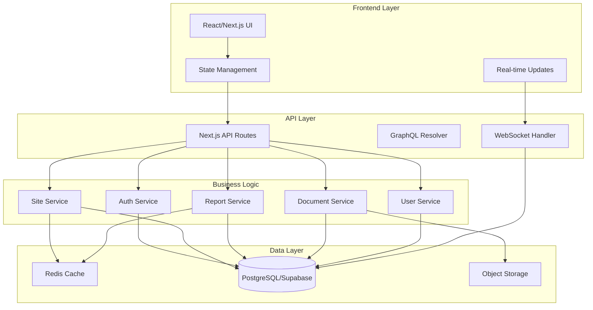

# System Integration Design Document
## Construction Management System (INOPNC)

---

## Executive Summary
This document outlines the comprehensive integration architecture for the INOPNC Construction Management System, focusing on creating seamless bidirectional data flow between all modules while maintaining data integrity, performance, and security.

---

## 1. System Architecture Design

### 1.1 Component Interaction Diagram



### 1.2 Data Flow Architecture

```typescript
// Core Integration Points
interface SystemIntegration {
  modules: {
    siteManagement: {
      triggers: ['site_created', 'site_updated', 'site_deleted'],
      listeners: ['worker_assigned', 'report_created', 'document_uploaded']
    },
    dailyReports: {
      triggers: ['report_created', 'report_updated', 'worker_hours_logged'],
      listeners: ['site_updated', 'weather_changed', 'material_used']
    },
    userManagement: {
      triggers: ['user_created', 'role_changed', 'certification_added'],
      listeners: ['site_assigned', 'report_created', 'document_shared']
    },
    documentManagement: {
      triggers: ['document_uploaded', 'document_shared', 'permission_changed'],
      listeners: ['site_created', 'report_created', 'user_assigned']
    }
  }
}
```

---

## 2. Database Schema Enhancement

### 2.1 Complete SQL Schema with Relationships

```sql
-- ==========================================
-- ENHANCED SITES TABLE WITH CUSTOMER RELATIONSHIPS
-- ==========================================

-- Customer companies table
CREATE TABLE IF NOT EXISTS customer_companies (
    id UUID PRIMARY KEY DEFAULT gen_random_uuid(),
    company_name TEXT NOT NULL,
    business_number TEXT UNIQUE,
    representative_name TEXT,
    contact_person TEXT,
    phone TEXT,
    email TEXT,
    address TEXT,
    contract_type TEXT CHECK (contract_type IN ('general', 'government', 'private')),
    credit_rating TEXT,
    is_active BOOLEAN DEFAULT true,
    created_at TIMESTAMP WITH TIME ZONE DEFAULT NOW(),
    updated_at TIMESTAMP WITH TIME ZONE DEFAULT NOW()
);

-- Enhanced sites table with customer relationship
ALTER TABLE sites ADD COLUMN IF NOT EXISTS customer_company_id UUID REFERENCES customer_companies(id);
ALTER TABLE sites ADD COLUMN IF NOT EXISTS contract_amount DECIMAL(15,2);
ALTER TABLE sites ADD COLUMN IF NOT EXISTS project_type TEXT;
ALTER TABLE sites ADD COLUMN IF NOT EXISTS construction_type TEXT;
ALTER TABLE sites ADD COLUMN IF NOT EXISTS total_area DECIMAL(10,2);
ALTER TABLE sites ADD COLUMN IF NOT EXISTS floor_count INTEGER;
ALTER TABLE sites ADD COLUMN IF NOT EXISTS underground_floor_count INTEGER;

-- Customer-Site relationship table (for multiple customers per site)
CREATE TABLE IF NOT EXISTS customer_sites (
    id UUID PRIMARY KEY DEFAULT gen_random_uuid(),
    customer_company_id UUID NOT NULL REFERENCES customer_companies(id) ON DELETE CASCADE,
    site_id UUID NOT NULL REFERENCES sites(id) ON DELETE CASCADE,
    relationship_type TEXT CHECK (relationship_type IN ('owner', 'investor', 'partner')),
    share_percentage DECIMAL(5,2),
    contract_date DATE,
    created_at TIMESTAMP WITH TIME ZONE DEFAULT NOW(),
    UNIQUE(customer_company_id, site_id)
);

-- ==========================================
-- ENHANCED DAILY REPORTS WITH FULL RELATIONSHIPS
-- ==========================================

-- Add missing columns to daily_reports
ALTER TABLE daily_reports 
ADD COLUMN IF NOT EXISTS weather_morning TEXT,
ADD COLUMN IF NOT EXISTS weather_afternoon TEXT,
ADD COLUMN IF NOT EXISTS temperature_high DECIMAL(4,1),
ADD COLUMN IF NOT EXISTS temperature_low DECIMAL(4,1),
ADD COLUMN IF NOT EXISTS safety_issues TEXT,
ADD COLUMN IF NOT EXISTS quality_issues TEXT,
ADD COLUMN IF NOT EXISTS tomorrow_plan TEXT,
ADD COLUMN IF NOT EXISTS special_notes TEXT,
ADD COLUMN IF NOT EXISTS customer_company_id UUID REFERENCES customer_companies(id);

-- Worker assignments junction table (many-to-many)
CREATE TABLE IF NOT EXISTS worker_assignments (
    id UUID PRIMARY KEY DEFAULT gen_random_uuid(),
    daily_report_id UUID NOT NULL REFERENCES daily_reports(id) ON DELETE CASCADE,
    worker_id UUID NOT NULL REFERENCES profiles(id),
    work_type TEXT NOT NULL,
    work_hours DECIMAL(4,2) NOT NULL DEFAULT 8,
    overtime_hours DECIMAL(4,2) DEFAULT 0,
    work_description TEXT,
    team_name TEXT,
    is_team_leader BOOLEAN DEFAULT false,
    created_at TIMESTAMP WITH TIME ZONE DEFAULT NOW(),
    UNIQUE(daily_report_id, worker_id)
);

CREATE INDEX idx_worker_assignments_report ON worker_assignments(daily_report_id);
CREATE INDEX idx_worker_assignments_worker ON worker_assignments(worker_id);
CREATE INDEX idx_worker_assignments_date ON worker_assignments(created_at);

-- Manager assignments for daily reports
CREATE TABLE IF NOT EXISTS report_managers (
    id UUID PRIMARY KEY DEFAULT gen_random_uuid(),
    daily_report_id UUID NOT NULL REFERENCES daily_reports(id) ON DELETE CASCADE,
    manager_id UUID NOT NULL REFERENCES profiles(id),
    manager_type TEXT CHECK (manager_type IN ('site_manager', 'safety_manager', 'quality_manager', 'customer_manager')),
    created_at TIMESTAMP WITH TIME ZONE DEFAULT NOW(),
    UNIQUE(daily_report_id, manager_id, manager_type)
);

-- ==========================================
-- UNIFIED DOCUMENTS TABLE WITH CONTEXT SUPPORT
-- ==========================================

-- Enhanced documents table supporting multiple contexts
CREATE TABLE IF NOT EXISTS unified_documents (
    id UUID PRIMARY KEY DEFAULT gen_random_uuid(),
    
    -- Basic document info
    title TEXT NOT NULL,
    file_name TEXT NOT NULL,
    file_url TEXT NOT NULL,
    file_size BIGINT,
    mime_type TEXT,
    description TEXT,
    
    -- Context relationships (polymorphic)
    context_type TEXT CHECK (context_type IN ('site', 'daily_report', 'user', 'material_request', 'safety_inspection', 'quality_inspection')),
    context_id UUID, -- References the related entity
    
    -- Specific foreign keys for strong relationships
    site_id UUID REFERENCES sites(id) ON DELETE CASCADE,
    daily_report_id UUID REFERENCES daily_reports(id) ON DELETE CASCADE,
    user_id UUID REFERENCES profiles(id) ON DELETE CASCADE,
    
    -- Document categorization
    document_category TEXT CHECK (document_category IN (
        'contract', 'blueprint', 'specification', 'permit', 'certificate',
        'report', 'photo', 'receipt', 'invoice', 'safety', 'quality', 'other'
    )),
    document_subcategory TEXT,
    
    -- Metadata
    tags TEXT[],
    version INTEGER DEFAULT 1,
    is_latest BOOLEAN DEFAULT true,
    parent_document_id UUID REFERENCES unified_documents(id),
    
    -- Security and sharing
    owner_id UUID NOT NULL REFERENCES profiles(id),
    is_public BOOLEAN DEFAULT false,
    access_level TEXT DEFAULT 'private' CHECK (access_level IN ('private', 'site', 'organization', 'public')),
    
    -- Timestamps
    created_at TIMESTAMP WITH TIME ZONE DEFAULT NOW(),
    updated_at TIMESTAMP WITH TIME ZONE DEFAULT NOW(),
    expires_at TIMESTAMP WITH TIME ZONE,
    
    -- Indexing for search
    search_vector tsvector
);

-- Create indexes for performance
CREATE INDEX idx_unified_documents_site ON unified_documents(site_id) WHERE site_id IS NOT NULL;
CREATE INDEX idx_unified_documents_report ON unified_documents(daily_report_id) WHERE daily_report_id IS NOT NULL;
CREATE INDEX idx_unified_documents_context ON unified_documents(context_type, context_id);
CREATE INDEX idx_unified_documents_category ON unified_documents(document_category);
CREATE INDEX idx_unified_documents_owner ON unified_documents(owner_id);
CREATE INDEX idx_unified_documents_search ON unified_documents USING gin(search_vector);

-- Update search vector trigger
CREATE OR REPLACE FUNCTION update_document_search_vector() RETURNS trigger AS $$
BEGIN
    NEW.search_vector := 
        setweight(to_tsvector('simple', coalesce(NEW.title, '')), 'A') ||
        setweight(to_tsvector('simple', coalesce(NEW.description, '')), 'B') ||
        setweight(to_tsvector('simple', array_to_string(NEW.tags, ' ')), 'C');
    RETURN NEW;
END;
$$ LANGUAGE plpgsql;

CREATE TRIGGER update_document_search_vector_trigger
BEFORE INSERT OR UPDATE ON unified_documents
FOR EACH ROW EXECUTE FUNCTION update_document_search_vector();

-- ==========================================
-- ENHANCED RELATIONSHIPS AND JUNCTION TABLES
-- ==========================================

-- Site managers (multiple managers per site)
CREATE TABLE IF NOT EXISTS site_managers (
    id UUID PRIMARY KEY DEFAULT gen_random_uuid(),
    site_id UUID NOT NULL REFERENCES sites(id) ON DELETE CASCADE,
    manager_id UUID NOT NULL REFERENCES profiles(id),
    manager_role TEXT CHECK (manager_role IN (
        'project_manager', 'site_manager', 'safety_manager', 
        'quality_manager', 'construction_manager'
    )),
    is_primary BOOLEAN DEFAULT false,
    assigned_date DATE NOT NULL DEFAULT CURRENT_DATE,
    unassigned_date DATE,
    created_at TIMESTAMP WITH TIME ZONE DEFAULT NOW(),
    UNIQUE(site_id, manager_id, manager_role)
);

-- Enhanced site workers with skills
CREATE TABLE IF NOT EXISTS site_workers (
    id UUID PRIMARY KEY DEFAULT gen_random_uuid(),
    site_id UUID NOT NULL REFERENCES sites(id) ON DELETE CASCADE,
    worker_id UUID NOT NULL REFERENCES profiles(id),
    trade_type TEXT NOT NULL, -- '철근공', '목수', '전기공', etc.
    skill_level TEXT CHECK (skill_level IN ('견습', '숙련', '전문가', '마스터')),
    daily_rate DECIMAL(10,2),
    assigned_date DATE NOT NULL DEFAULT CURRENT_DATE,
    unassigned_date DATE,
    is_active BOOLEAN DEFAULT true,
    created_at TIMESTAMP WITH TIME ZONE DEFAULT NOW(),
    UNIQUE(site_id, worker_id)
);

-- Material usage tracking per daily report
CREATE TABLE IF NOT EXISTS report_material_usage (
    id UUID PRIMARY KEY DEFAULT gen_random_uuid(),
    daily_report_id UUID NOT NULL REFERENCES daily_reports(id) ON DELETE CASCADE,
    material_id UUID NOT NULL REFERENCES materials(id),
    quantity_used DECIMAL(10,2) NOT NULL,
    unit_of_measure TEXT NOT NULL,
    purpose TEXT,
    location_used TEXT,
    created_at TIMESTAMP WITH TIME ZONE DEFAULT NOW()
);

-- Equipment usage per daily report
CREATE TABLE IF NOT EXISTS report_equipment_usage (
    id UUID PRIMARY KEY DEFAULT gen_random_uuid(),
    daily_report_id UUID NOT NULL REFERENCES daily_reports(id) ON DELETE CASCADE,
    equipment_id UUID NOT NULL REFERENCES equipment(id),
    hours_used DECIMAL(4,2) NOT NULL,
    operator_id UUID REFERENCES profiles(id),
    fuel_consumed DECIMAL(6,2),
    notes TEXT,
    created_at TIMESTAMP WITH TIME ZONE DEFAULT NOW()
);

-- ==========================================
-- ROW LEVEL SECURITY POLICIES
-- ==========================================

-- Enable RLS on all new tables
ALTER TABLE customer_companies ENABLE ROW LEVEL SECURITY;
ALTER TABLE customer_sites ENABLE ROW LEVEL SECURITY;
ALTER TABLE worker_assignments ENABLE ROW LEVEL SECURITY;
ALTER TABLE report_managers ENABLE ROW LEVEL SECURITY;
ALTER TABLE unified_documents ENABLE ROW LEVEL SECURITY;
ALTER TABLE site_managers ENABLE ROW LEVEL SECURITY;
ALTER TABLE site_workers ENABLE ROW LEVEL SECURITY;
ALTER TABLE report_material_usage ENABLE ROW LEVEL SECURITY;
ALTER TABLE report_equipment_usage ENABLE ROW LEVEL SECURITY;

-- Create comprehensive RLS policies
-- Documents: Users can see documents based on context
CREATE POLICY "unified_documents_select" ON unified_documents FOR SELECT
USING (
    owner_id = auth.uid() OR
    is_public = true OR
    site_id IN (
        SELECT site_id FROM site_assignments WHERE user_id = auth.uid() AND is_active = true
        UNION
        SELECT site_id FROM site_managers WHERE manager_id = auth.uid() AND unassigned_date IS NULL
        UNION
        SELECT site_id FROM site_workers WHERE worker_id = auth.uid() AND is_active = true
    )
);

-- Worker assignments: Viewable by site members
CREATE POLICY "worker_assignments_select" ON worker_assignments FOR SELECT
USING (
    worker_id = auth.uid() OR
    daily_report_id IN (
        SELECT id FROM daily_reports WHERE created_by = auth.uid()
    ) OR
    EXISTS (
        SELECT 1 FROM daily_reports dr
        JOIN site_assignments sa ON dr.site_id = sa.site_id
        WHERE dr.id = worker_assignments.daily_report_id
        AND sa.user_id = auth.uid()
        AND sa.is_active = true
    )
);
```

---

## 3. API Design Specification

### 3.1 RESTful Endpoints for Integrated Queries

```typescript
// API Route: /api/sites/[id]/integrated
export async function GET(
  request: Request,
  { params }: { params: { id: string } }
) {
  const siteId = params.id
  
  // Fetch integrated site data with all relationships
  const query = `
    SELECT 
      s.*,
      json_build_object(
        'company_name', cc.company_name,
        'contact_person', cc.contact_person,
        'phone', cc.phone
      ) as customer,
      (
        SELECT json_agg(json_build_object(
          'id', sm.manager_id,
          'full_name', p.full_name,
          'role', sm.manager_role,
          'phone', p.phone
        ))
        FROM site_managers sm
        JOIN profiles p ON sm.manager_id = p.id
        WHERE sm.site_id = s.id AND sm.unassigned_date IS NULL
      ) as managers,
      (
        SELECT json_agg(json_build_object(
          'id', sw.worker_id,
          'full_name', p.full_name,
          'trade_type', sw.trade_type,
          'skill_level', sw.skill_level
        ))
        FROM site_workers sw
        JOIN profiles p ON sw.worker_id = p.id
        WHERE sw.site_id = s.id AND sw.is_active = true
      ) as workers,
      (
        SELECT COUNT(*) 
        FROM daily_reports 
        WHERE site_id = s.id
      ) as total_reports,
      (
        SELECT COUNT(*) 
        FROM unified_documents 
        WHERE site_id = s.id
      ) as total_documents
    FROM sites s
    LEFT JOIN customer_companies cc ON s.customer_company_id = cc.id
    WHERE s.id = $1
  `
  
  const result = await executeQuery(query, [siteId])
  return NextResponse.json(result)
}
```

### 3.2 GraphQL Schema for Complex Relationships

```graphql
type Site {
  id: ID!
  name: String!
  address: String!
  status: SiteStatus!
  customer: Customer
  managers: [SiteManager!]!
  workers: [SiteWorker!]!
  dailyReports(
    startDate: Date
    endDate: Date
    status: ReportStatus
    limit: Int
  ): [DailyReport!]!
  documents(
    category: DocumentCategory
    limit: Int
  ): [Document!]!
  statistics: SiteStatistics!
}

type DailyReport {
  id: ID!
  workDate: Date!
  site: Site!
  createdBy: User!
  workers: [WorkerAssignment!]!
  materials: [MaterialUsage!]!
  equipment: [EquipmentUsage!]!
  documents: [Document!]!
  weather: WeatherCondition!
  issues: String
  tomorrowPlan: String
}

type WorkerAssignment {
  worker: User!
  workType: String!
  workHours: Float!
  overtimeHours: Float!
  isTeamLeader: Boolean!
  teamName: String
}

type Query {
  site(id: ID!): Site
  siteIntegratedView(
    siteId: ID!
    includeReports: Boolean
    includeDocuments: Boolean
    includeWorkers: Boolean
  ): SiteIntegratedData!
  
  dailyReportWithRelations(id: ID!): DailyReport
  searchDocuments(
    query: String!
    contextType: ContextType
    contextId: ID
  ): [Document!]!
}

type Mutation {
  createDailyReportWithRelations(
    input: DailyReportInput!
  ): DailyReportResult!
  
  assignWorkersToSite(
    siteId: ID!
    workerIds: [ID!]!
  ): AssignmentResult!
  
  linkDocumentToContexts(
    documentId: ID!
    contexts: [DocumentContext!]!
  ): Document!
}
```

---

## 4. Frontend Integration Strategy

### 4.1 Component Architecture for Cross-Module Features

```typescript
// Unified Site View Component
import { useState, useEffect } from 'react'
import { useQuery, useMutation } from '@tanstack/react-query'

interface UnifiedSiteViewProps {
  siteId: string
}

export function UnifiedSiteView({ siteId }: UnifiedSiteViewProps) {
  const [activeTab, setActiveTab] = useState<'overview' | 'reports' | 'workers' | 'documents'>('overview')
  
  // Fetch integrated site data
  const { data: siteData, isLoading } = useQuery({
    queryKey: ['site', siteId, 'integrated'],
    queryFn: () => fetchIntegratedSiteData(siteId),
    staleTime: 5 * 60 * 1000, // 5 minutes
  })
  
  // Real-time subscriptions
  useEffect(() => {
    const subscription = supabase
      .channel(`site:${siteId}`)
      .on('postgres_changes', 
        { 
          event: '*', 
          schema: 'public', 
          table: 'daily_reports',
          filter: `site_id=eq.${siteId}`
        },
        (payload) => {
          // Handle real-time updates
          queryClient.invalidateQueries(['site', siteId])
        }
      )
      .subscribe()
    
    return () => {
      subscription.unsubscribe()
    }
  }, [siteId])
  
  return (
    <div className="flex flex-col h-full">
      <SiteHeader site={siteData?.site} />
      
      <Tabs value={activeTab} onValueChange={setActiveTab}>
        <TabsList>
          <TabsTrigger value="overview">개요</TabsTrigger>
          <TabsTrigger value="reports">
            작업일지 
            <Badge>{siteData?.statistics.totalReports}</Badge>
          </TabsTrigger>
          <TabsTrigger value="workers">
            작업자 
            <Badge>{siteData?.statistics.activeWorkers}</Badge>
          </TabsTrigger>
          <TabsTrigger value="documents">
            문서 
            <Badge>{siteData?.statistics.totalDocuments}</Badge>
          </TabsTrigger>
        </TabsList>
        
        <TabsContent value="overview">
          <SiteOverview data={siteData} />
        </TabsContent>
        
        <TabsContent value="reports">
          <IntegratedReportsView 
            siteId={siteId}
            workers={siteData?.workers}
            managers={siteData?.managers}
          />
        </TabsContent>
        
        <TabsContent value="workers">
          <WorkerManagementView 
            siteId={siteId}
            workers={siteData?.workers}
            onUpdate={refetch}
          />
        </TabsContent>
        
        <TabsContent value="documents">
          <IntegratedDocumentsView 
            siteId={siteId}
            contextType="site"
          />
        </TabsContent>
      </Tabs>
    </div>
  )
}
```

### 4.2 State Management for Shared Data

```typescript
// Zustand store for integrated state management
import { create } from 'zustand'
import { devtools, persist } from 'zustand/middleware'

interface IntegratedState {
  // Current context
  currentSite: Site | null
  currentUser: User | null
  
  // Cached relationships
  siteWorkers: Map<string, Worker[]>
  siteManagers: Map<string, Manager[]>
  reportDocuments: Map<string, Document[]>
  
  // Actions
  setSite: (site: Site) => void
  updateSiteWorkers: (siteId: string, workers: Worker[]) => void
  addDocument: (contextType: string, contextId: string, document: Document) => void
  
  // Integrated queries
  fetchSiteWithRelations: (siteId: string) => Promise<void>
  fetchReportWithRelations: (reportId: string) => Promise<void>
}

export const useIntegratedStore = create<IntegratedState>()(
  devtools(
    persist(
      (set, get) => ({
        currentSite: null,
        currentUser: null,
        siteWorkers: new Map(),
        siteManagers: new Map(),
        reportDocuments: new Map(),
        
        setSite: (site) => set({ currentSite: site }),
        
        updateSiteWorkers: (siteId, workers) => 
          set((state) => ({
            siteWorkers: new Map(state.siteWorkers).set(siteId, workers)
          })),
        
        addDocument: (contextType, contextId, document) => 
          set((state) => {
            const key = `${contextType}:${contextId}`
            const docs = state.reportDocuments.get(key) || []
            return {
              reportDocuments: new Map(state.reportDocuments).set(key, [...docs, document])
            }
          }),
        
        fetchSiteWithRelations: async (siteId) => {
          const response = await fetch(`/api/sites/${siteId}/integrated`)
          const data = await response.json()
          
          set({
            currentSite: data.site,
            siteWorkers: new Map([[siteId, data.workers]]),
            siteManagers: new Map([[siteId, data.managers]])
          })
        },
        
        fetchReportWithRelations: async (reportId) => {
          const response = await fetch(`/api/daily-reports/${reportId}/integrated`)
          const data = await response.json()
          
          const key = `daily_report:${reportId}`
          set((state) => ({
            reportDocuments: new Map(state.reportDocuments).set(key, data.documents)
          }))
        }
      }),
      {
        name: 'integrated-storage',
        partialize: (state) => ({
          currentSite: state.currentSite,
          currentUser: state.currentUser
        })
      }
    )
  )
)
```

### 4.3 Navigation and Routing Strategy

```typescript
// app/dashboard/integrated/[module]/page.tsx
export default function IntegratedModulePage({
  params,
  searchParams
}: {
  params: { module: string }
  searchParams: { siteId?: string, reportId?: string, userId?: string }
}) {
  const router = useRouter()
  const { module } = params
  const { siteId, reportId, userId } = searchParams
  
  // Dynamic component loading based on module and context
  const renderModule = () => {
    switch (module) {
      case 'site-reports':
        return <SiteReportsIntegration siteId={siteId!} />
      
      case 'worker-reports':
        return <WorkerReportsView workerId={userId!} />
      
      case 'report-details':
        return <IntegratedReportDetails reportId={reportId!} />
      
      case 'cross-site-analytics':
        return <CrossSiteAnalytics />
      
      default:
        return <ModuleNotFound />
    }
  }
  
  // Breadcrumb navigation with context
  const breadcrumbs = useMemo(() => {
    const items = [{ label: '대시보드', href: '/dashboard' }]
    
    if (siteId) {
      items.push({ 
        label: '현장 관리', 
        href: `/dashboard/sites/${siteId}` 
      })
    }
    
    if (reportId) {
      items.push({ 
        label: '작업일지', 
        href: `/dashboard/reports/${reportId}` 
      })
    }
    
    return items
  }, [siteId, reportId])
  
  return (
    <div className="flex flex-col h-full">
      <Breadcrumbs items={breadcrumbs} />
      <div className="flex-1 overflow-auto">
        {renderModule()}
      </div>
    </div>
  )
}
```

---

## 5. Implementation Roadmap

### Phase 1: Database Schema Migration (Week 1-2)

```typescript
// Migration execution plan
const migrationPlan = {
  week1: {
    day1_2: [
      'Create customer_companies table',
      'Create customer_sites relationship',
      'Enhance sites table with new columns'
    ],
    day3_4: [
      'Create worker_assignments table',
      'Create report_managers table',
      'Add indexes for performance'
    ],
    day5: [
      'Create unified_documents table',
      'Migrate existing documents',
      'Test data integrity'
    ]
  },
  week2: {
    day1_2: [
      'Create site_managers table',
      'Create site_workers table',
      'Create material/equipment usage tables'
    ],
    day3_4: [
      'Implement RLS policies',
      'Create database functions',
      'Performance testing'
    ],
    day5: [
      'Data migration from old schema',
      'Validation and rollback planning'
    ]
  }
}
```

### Phase 2: API Development (Week 3-4)

```typescript
// API implementation checklist
const apiDevelopment = {
  week3: {
    restfulEndpoints: [
      '/api/sites/[id]/integrated',
      '/api/daily-reports/[id]/full',
      '/api/workers/[id]/assignments',
      '/api/documents/search'
    ],
    graphqlResolvers: [
      'Site.dailyReports',
      'DailyReport.workers',
      'Document.contexts',
      'User.sites'
    ]
  },
  week4: {
    realTimeSubscriptions: [
      'siteUpdates',
      'reportCreated',
      'documentUploaded',
      'workerAssigned'
    ],
    caching: [
      'Redis integration',
      'Query optimization',
      'Cache invalidation strategy'
    ]
  }
}
```

### Phase 3: UI Component Integration (Week 5-6)

```typescript
// Component development timeline
const uiIntegration = {
  week5: {
    components: [
      'UnifiedSiteView',
      'IntegratedReportForm',
      'CrossModuleSearch',
      'RelationshipVisualizer'
    ],
    stateManagement: [
      'Zustand store setup',
      'React Query integration',
      'Real-time sync implementation'
    ]
  },
  week6: {
    views: [
      'Site dashboard with all relations',
      'Report creation with auto-population',
      'Document browser with context',
      'Worker timeline view'
    ],
    mobile: [
      'Responsive layouts',
      'Touch gestures',
      'Offline support'
    ]
  }
}
```

### Phase 4: Testing and Optimization (Week 7-8)

```typescript
// Testing and optimization plan
const testingPhase = {
  week7: {
    unitTests: [
      'API endpoint tests',
      'Component tests',
      'Integration tests',
      'E2E tests'
    ],
    performanceTests: [
      'Database query optimization',
      'API response time',
      'Frontend rendering performance',
      'Memory usage analysis'
    ]
  },
  week8: {
    optimization: [
      'Query optimization',
      'Index tuning',
      'Cache strategy refinement',
      'Bundle size optimization'
    ],
    deployment: [
      'Staging deployment',
      'User acceptance testing',
      'Performance monitoring setup',
      'Production deployment'
    ]
  }
}
```

---

## 6. Code Examples

### 6.1 Database Query with Joins

```typescript
// Complex query to fetch daily report with all relationships
export async function getDailyReportWithRelations(reportId: string) {
  const { data, error } = await supabase
    .from('daily_reports')
    .select(`
      *,
      site:sites!site_id (
        id,
        name,
        address,
        customer_company:customer_companies!customer_company_id (
          company_name,
          contact_person,
          phone
        ),
        managers:site_managers!site_id (
          manager:profiles!manager_id (
            id,
            full_name,
            phone,
            email
          ),
          manager_role
        )
      ),
      created_by:profiles!created_by (
        id,
        full_name,
        role
      ),
      workers:worker_assignments!daily_report_id (
        worker:profiles!worker_id (
          id,
          full_name,
          phone
        ),
        work_type,
        work_hours,
        overtime_hours,
        team_name,
        is_team_leader
      ),
      materials:report_material_usage!daily_report_id (
        material:materials!material_id (
          id,
          name,
          unit
        ),
        quantity_used,
        purpose
      ),
      documents:unified_documents!daily_report_id (
        id,
        title,
        file_url,
        document_category,
        created_at
      )
    `)
    .eq('id', reportId)
    .single()
  
  if (error) throw error
  
  return data
}
```

### 6.2 API Endpoint Implementation

```typescript
// app/api/sites/[id]/integrated/route.ts
import { NextRequest, NextResponse } from 'next/server'
import { createRouteHandlerClient } from '@supabase/auth-helpers-nextjs'
import { cookies } from 'next/headers'

export async function GET(
  request: NextRequest,
  { params }: { params: { id: string } }
) {
  try {
    const supabase = createRouteHandlerClient({ cookies })
    const { id: siteId } = params
    
    // Check user permissions
    const { data: { user } } = await supabase.auth.getUser()
    if (!user) {
      return NextResponse.json({ error: 'Unauthorized' }, { status: 401 })
    }
    
    // Fetch integrated site data
    const { data: site, error: siteError } = await supabase
      .from('sites')
      .select(`
        *,
        customer_company:customer_companies!customer_company_id (*),
        customer_sites!site_id (
          customer:customer_companies!customer_company_id (*)
        )
      `)
      .eq('id', siteId)
      .single()
    
    if (siteError) throw siteError
    
    // Fetch managers
    const { data: managers } = await supabase
      .from('site_managers')
      .select(`
        *,
        manager:profiles!manager_id (*)
      `)
      .eq('site_id', siteId)
      .is('unassigned_date', null)
    
    // Fetch active workers
    const { data: workers } = await supabase
      .from('site_workers')
      .select(`
        *,
        worker:profiles!worker_id (*)
      `)
      .eq('site_id', siteId)
      .eq('is_active', true)
    
    // Fetch recent reports
    const { data: recentReports } = await supabase
      .from('daily_reports')
      .select(`
        id,
        work_date,
        status,
        created_by:profiles!created_by (full_name),
        total_workers
      `)
      .eq('site_id', siteId)
      .order('work_date', { ascending: false })
      .limit(10)
    
    // Fetch document count by category
    const { data: documentStats } = await supabase
      .from('unified_documents')
      .select('document_category')
      .eq('site_id', siteId)
      .then(result => {
        const stats = result.data?.reduce((acc, doc) => {
          acc[doc.document_category] = (acc[doc.document_category] || 0) + 1
          return acc
        }, {} as Record<string, number>)
        return { data: stats, error: null }
      })
    
    // Compile response
    const response = {
      site,
      managers: managers || [],
      workers: workers || [],
      recentReports: recentReports || [],
      documentStats: documentStats || {},
      statistics: {
        totalManagers: managers?.length || 0,
        totalWorkers: workers?.length || 0,
        totalReports: recentReports?.length || 0,
        activeWorkers: workers?.filter(w => w.is_active).length || 0
      }
    }
    
    return NextResponse.json(response)
    
  } catch (error) {
    console.error('Error fetching integrated site data:', error)
    return NextResponse.json(
      { error: 'Failed to fetch site data' },
      { status: 500 }
    )
  }
}

// Update site with relationships
export async function PUT(
  request: NextRequest,
  { params }: { params: { id: string } }
) {
  try {
    const supabase = createRouteHandlerClient({ cookies })
    const { id: siteId } = params
    const body = await request.json()
    
    // Start transaction
    const updates = []
    
    // Update site basic info
    if (body.site) {
      updates.push(
        supabase
          .from('sites')
          .update(body.site)
          .eq('id', siteId)
      )
    }
    
    // Update managers
    if (body.managers) {
      // Remove old managers
      await supabase
        .from('site_managers')
        .update({ unassigned_date: new Date().toISOString() })
        .eq('site_id', siteId)
        .is('unassigned_date', null)
      
      // Add new managers
      const managerInserts = body.managers.map((m: any) => ({
        site_id: siteId,
        manager_id: m.manager_id,
        manager_role: m.manager_role,
        is_primary: m.is_primary
      }))
      
      if (managerInserts.length > 0) {
        updates.push(
          supabase
            .from('site_managers')
            .insert(managerInserts)
        )
      }
    }
    
    // Execute all updates
    const results = await Promise.all(updates)
    const errors = results.filter(r => r.error)
    
    if (errors.length > 0) {
      throw new Error('Failed to update site')
    }
    
    return NextResponse.json({ success: true })
    
  } catch (error) {
    console.error('Error updating site:', error)
    return NextResponse.json(
      { error: 'Failed to update site' },
      { status: 500 }
    )
  }
}
```

### 6.3 React Component for Integrated View

```tsx
// components/integrated/DailyReportIntegratedForm.tsx
import { useState, useEffect } from 'react'
import { useForm } from 'react-hook-form'
import { zodResolver } from '@hookform/resolvers/zod'
import { z } from 'zod'
import { useQuery, useMutation } from '@tanstack/react-query'

const reportSchema = z.object({
  site_id: z.string().uuid(),
  work_date: z.string(),
  weather_morning: z.string(),
  weather_afternoon: z.string(),
  workers: z.array(z.object({
    worker_id: z.string().uuid(),
    work_type: z.string(),
    work_hours: z.number(),
    overtime_hours: z.number().optional()
  })),
  materials: z.array(z.object({
    material_id: z.string().uuid(),
    quantity_used: z.number(),
    purpose: z.string()
  })),
  issues: z.string().optional(),
  tomorrow_plan: z.string().optional()
})

type ReportFormData = z.infer<typeof reportSchema>

export function DailyReportIntegratedForm({ siteId }: { siteId: string }) {
  const [selectedWorkers, setSelectedWorkers] = useState<string[]>([])
  const [selectedMaterials, setSelectedMaterials] = useState<string[]>([])
  
  // Fetch site data with workers and materials
  const { data: siteData } = useQuery({
    queryKey: ['site', siteId, 'form-data'],
    queryFn: async () => {
      const response = await fetch(`/api/sites/${siteId}/form-data`)
      return response.json()
    }
  })
  
  const form = useForm<ReportFormData>({
    resolver: zodResolver(reportSchema),
    defaultValues: {
      site_id: siteId,
      work_date: new Date().toISOString().split('T')[0],
      workers: [],
      materials: []
    }
  })
  
  // Auto-populate workers from site
  useEffect(() => {
    if (siteData?.activeWorkers) {
      const defaultWorkers = siteData.activeWorkers.map((worker: any) => ({
        worker_id: worker.worker_id,
        work_type: worker.trade_type,
        work_hours: 8,
        overtime_hours: 0
      }))
      form.setValue('workers', defaultWorkers)
      setSelectedWorkers(defaultWorkers.map((w: any) => w.worker_id))
    }
  }, [siteData])
  
  const createReport = useMutation({
    mutationFn: async (data: ReportFormData) => {
      const response = await fetch('/api/daily-reports/integrated', {
        method: 'POST',
        headers: { 'Content-Type': 'application/json' },
        body: JSON.stringify(data)
      })
      if (!response.ok) throw new Error('Failed to create report')
      return response.json()
    },
    onSuccess: (data) => {
      toast({
        title: '작업일지 생성 완료',
        description: `${data.work_date} 작업일지가 생성되었습니다.`
      })
      router.push(`/dashboard/daily-reports/${data.id}`)
    }
  })
  
  const onSubmit = (data: ReportFormData) => {
    createReport.mutate(data)
  }
  
  return (
    <Form {...form}>
      <form onSubmit={form.handleSubmit(onSubmit)} className="space-y-6">
        {/* Site Information (Read-only) */}
        <Card>
          <CardHeader>
            <CardTitle>현장 정보</CardTitle>
          </CardHeader>
          <CardContent>
            <div className="grid grid-cols-2 gap-4">
              <div>
                <Label>현장명</Label>
                <div className="font-medium">{siteData?.site.name}</div>
              </div>
              <div>
                <Label>고객사</Label>
                <div className="font-medium">
                  {siteData?.site.customer_company?.company_name}
                </div>
              </div>
            </div>
          </CardContent>
        </Card>
        
        {/* Worker Assignment with Auto-population */}
        <Card>
          <CardHeader>
            <CardTitle>작업자 배정</CardTitle>
            <CardDescription>
              현장에 등록된 작업자가 자동으로 표시됩니다
            </CardDescription>
          </CardHeader>
          <CardContent>
            <div className="space-y-4">
              {form.watch('workers').map((worker, index) => (
                <div key={worker.worker_id} className="flex items-center gap-4">
                  <div className="flex-1">
                    <Label>작업자</Label>
                    <div className="font-medium">
                      {siteData?.activeWorkers.find(
                        (w: any) => w.worker_id === worker.worker_id
                      )?.worker.full_name}
                    </div>
                  </div>
                  <div className="w-32">
                    <Label>작업 유형</Label>
                    <Input
                      {...form.register(`workers.${index}.work_type`)}
                      placeholder="작업 유형"
                    />
                  </div>
                  <div className="w-24">
                    <Label>작업시간</Label>
                    <Input
                      type="number"
                      {...form.register(`workers.${index}.work_hours`, {
                        valueAsNumber: true
                      })}
                    />
                  </div>
                  <div className="w-24">
                    <Label>초과근무</Label>
                    <Input
                      type="number"
                      {...form.register(`workers.${index}.overtime_hours`, {
                        valueAsNumber: true
                      })}
                    />
                  </div>
                  <Button
                    type="button"
                    variant="ghost"
                    size="icon"
                    onClick={() => removeWorker(index)}
                  >
                    <X className="h-4 w-4" />
                  </Button>
                </div>
              ))}
              
              <Button
                type="button"
                variant="outline"
                onClick={() => setShowWorkerModal(true)}
              >
                <Plus className="h-4 w-4 mr-2" />
                작업자 추가
              </Button>
            </div>
          </CardContent>
        </Card>
        
        {/* Material Usage */}
        <Card>
          <CardHeader>
            <CardTitle>자재 사용</CardTitle>
          </CardHeader>
          <CardContent>
            <MaterialUsageForm
              materials={siteData?.availableMaterials}
              onUpdate={(materials) => form.setValue('materials', materials)}
            />
          </CardContent>
        </Card>
        
        {/* Submit */}
        <div className="flex justify-end gap-4">
          <Button type="button" variant="outline" onClick={() => router.back()}>
            취소
          </Button>
          <Button type="submit" disabled={createReport.isPending}>
            {createReport.isPending ? '저장 중...' : '작업일지 생성'}
          </Button>
        </div>
      </form>
    </Form>
  )
}
```

### 6.4 TypeScript Type Definitions

```typescript
// types/integrated.ts

// Site with full relationships
export interface IntegratedSite extends Site {
  customer?: CustomerCompany
  additionalCustomers?: CustomerSite[]
  managers: SiteManager[]
  workers: SiteWorker[]
  statistics: {
    totalReports: number
    totalDocuments: number
    activeWorkers: number
    completedReports: number
    pendingReports: number
  }
}

// Daily report with full relationships
export interface IntegratedDailyReport extends DailyReport {
  site: {
    id: string
    name: string
    address: string
    customer?: CustomerCompany
  }
  workers: WorkerAssignment[]
  managers: ReportManager[]
  materials: MaterialUsage[]
  equipment: EquipmentUsage[]
  documents: UnifiedDocument[]
  weather: WeatherCondition
}

// Worker assignment with profile
export interface WorkerAssignment {
  id: string
  daily_report_id: string
  worker: {
    id: string
    full_name: string
    phone?: string
    trade_type?: string
    skill_level?: string
  }
  work_type: string
  work_hours: number
  overtime_hours: number
  team_name?: string
  is_team_leader: boolean
}

// Unified document with contexts
export interface UnifiedDocument {
  id: string
  title: string
  file_name: string
  file_url: string
  file_size?: number
  mime_type?: string
  document_category: DocumentCategory
  context_type?: ContextType
  context_id?: string
  site?: Site
  daily_report?: DailyReport
  owner: Profile
  tags?: string[]
  created_at: string
  updated_at: string
}

// Customer company
export interface CustomerCompany {
  id: string
  company_name: string
  business_number?: string
  representative_name?: string
  contact_person?: string
  phone?: string
  email?: string
  address?: string
  contract_type?: 'general' | 'government' | 'private'
  credit_rating?: string
  is_active: boolean
}

// Site manager
export interface SiteManager {
  id: string
  site_id: string
  manager: Profile
  manager_role: 'project_manager' | 'site_manager' | 'safety_manager' | 'quality_manager' | 'construction_manager'
  is_primary: boolean
  assigned_date: string
  unassigned_date?: string
}

// Site worker
export interface SiteWorker {
  id: string
  site_id: string
  worker: Profile
  trade_type: string
  skill_level?: '견습' | '숙련' | '전문가' | '마스터'
  daily_rate?: number
  assigned_date: string
  unassigned_date?: string
  is_active: boolean
}

// Context types for documents
export type ContextType = 
  | 'site' 
  | 'daily_report' 
  | 'user' 
  | 'material_request' 
  | 'safety_inspection' 
  | 'quality_inspection'

// Document categories
export type DocumentCategory = 
  | 'contract' 
  | 'blueprint' 
  | 'specification' 
  | 'permit' 
  | 'certificate'
  | 'report' 
  | 'photo' 
  | 'receipt' 
  | 'invoice' 
  | 'safety' 
  | 'quality' 
  | 'other'
```

---

## 7. Security & Performance

### 7.1 Row Level Security Policies

```sql
-- Comprehensive RLS for integrated access
CREATE POLICY "integrated_site_access" ON sites FOR ALL
USING (
    -- Admins can access all
    EXISTS (
        SELECT 1 FROM profiles 
        WHERE id = auth.uid() AND role IN ('admin', 'system_admin')
    )
    OR
    -- Assigned managers can access
    EXISTS (
        SELECT 1 FROM site_managers 
        WHERE site_id = sites.id 
        AND manager_id = auth.uid() 
        AND unassigned_date IS NULL
    )
    OR
    -- Assigned workers can view
    EXISTS (
        SELECT 1 FROM site_workers 
        WHERE site_id = sites.id 
        AND worker_id = auth.uid() 
        AND is_active = true
    )
);

-- Document access based on context
CREATE POLICY "context_based_document_access" ON unified_documents FOR SELECT
USING (
    -- Owner can always access
    owner_id = auth.uid()
    OR
    -- Public documents
    is_public = true
    OR
    -- Site-based access
    (
        context_type = 'site' 
        AND context_id IN (
            SELECT site_id FROM site_workers 
            WHERE worker_id = auth.uid() AND is_active = true
            UNION
            SELECT site_id FROM site_managers 
            WHERE manager_id = auth.uid() AND unassigned_date IS NULL
        )
    )
    OR
    -- Report-based access
    (
        context_type = 'daily_report' 
        AND context_id IN (
            SELECT id FROM daily_reports 
            WHERE created_by = auth.uid()
            OR site_id IN (
                SELECT site_id FROM site_assignments 
                WHERE user_id = auth.uid() AND is_active = true
            )
        )
    )
);
```

### 7.2 Query Optimization Strategies

```typescript
// Optimized query with selective loading
export async function getOptimizedSiteData(
  siteId: string,
  options: {
    includeWorkers?: boolean
    includeReports?: boolean
    includeDocuments?: boolean
    reportLimit?: number
  } = {}
) {
  const supabase = createServerClient()
  
  // Base query
  let query = supabase
    .from('sites')
    .select(`
      id,
      name,
      address,
      status,
      customer_company:customer_companies!customer_company_id (
        company_name,
        contact_person
      )
    `)
    .eq('id', siteId)
    .single()
  
  // Parallel queries for better performance
  const promises = []
  
  if (options.includeWorkers) {
    promises.push(
      supabase
        .from('site_workers')
        .select('*, worker:profiles!worker_id(*)')
        .eq('site_id', siteId)
        .eq('is_active', true)
    )
  }
  
  if (options.includeReports) {
    promises.push(
      supabase
        .from('daily_reports')
        .select('id, work_date, status, total_workers')
        .eq('site_id', siteId)
        .order('work_date', { ascending: false })
        .limit(options.reportLimit || 10)
    )
  }
  
  if (options.includeDocuments) {
    promises.push(
      supabase
        .from('unified_documents')
        .select('id, title, document_category, created_at')
        .eq('site_id', siteId)
        .order('created_at', { ascending: false })
        .limit(20)
    )
  }
  
  const [siteResult, ...additionalResults] = await Promise.all([
    query,
    ...promises
  ])
  
  return {
    site: siteResult.data,
    workers: options.includeWorkers ? additionalResults[0]?.data : undefined,
    reports: options.includeReports ? 
      additionalResults[options.includeWorkers ? 1 : 0]?.data : undefined,
    documents: options.includeDocuments ? 
      additionalResults[promises.length - 1]?.data : undefined
  }
}
```

### 7.3 Caching Approach

```typescript
// Redis caching for frequently accessed relationships
import { Redis } from '@upstash/redis'

const redis = new Redis({
  url: process.env.UPSTASH_REDIS_REST_URL!,
  token: process.env.UPSTASH_REDIS_REST_TOKEN!
})

export class IntegrationCache {
  private static TTL = {
    SITE_WORKERS: 300, // 5 minutes
    SITE_MANAGERS: 600, // 10 minutes
    REPORT_WORKERS: 120, // 2 minutes
    DOCUMENT_CONTEXTS: 300 // 5 minutes
  }
  
  static async getSiteWorkers(siteId: string): Promise<SiteWorker[] | null> {
    const key = `site:${siteId}:workers`
    const cached = await redis.get<SiteWorker[]>(key)
    return cached
  }
  
  static async setSiteWorkers(siteId: string, workers: SiteWorker[]): Promise<void> {
    const key = `site:${siteId}:workers`
    await redis.setex(key, this.TTL.SITE_WORKERS, workers)
  }
  
  static async invalidateSite(siteId: string): Promise<void> {
    const keys = [
      `site:${siteId}:workers`,
      `site:${siteId}:managers`,
      `site:${siteId}:documents`
    ]
    await redis.del(...keys)
  }
  
  static async getReportWithCache(reportId: string): Promise<IntegratedDailyReport | null> {
    const key = `report:${reportId}:full`
    const cached = await redis.get<IntegratedDailyReport>(key)
    
    if (cached) return cached
    
    // Fetch from database
    const report = await getDailyReportWithRelations(reportId)
    
    if (report) {
      await redis.setex(key, this.TTL.REPORT_WORKERS, report)
    }
    
    return report
  }
}

// Cache invalidation on updates
export async function updateSiteWorkers(
  siteId: string, 
  workers: Partial<SiteWorker>[]
) {
  // Update database
  await updateWorkersInDB(siteId, workers)
  
  // Invalidate cache
  await IntegrationCache.invalidateSite(siteId)
  
  // Trigger real-time update
  await broadcastUpdate('site_workers_updated', { siteId, workers })
}
```

---

## Conclusion

This comprehensive integration design provides:

1. **Seamless Data Flow**: All modules are interconnected with proper relationships
2. **Performance Optimized**: Indexed queries, caching, and selective loading
3. **Type Safe**: Full TypeScript definitions for all entities
4. **Scalable Architecture**: Modular design allows for future expansion
5. **Security First**: Row-level security ensures data protection
6. **Real-time Updates**: WebSocket integration for live data synchronization

The implementation follows a phased approach allowing for incremental deployment and testing, ensuring minimal disruption to existing operations while maximizing the benefits of the integrated system.

For questions or clarifications, please contact the development team.