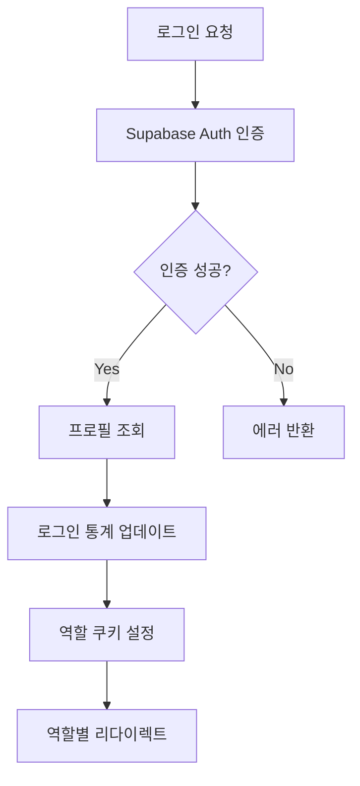
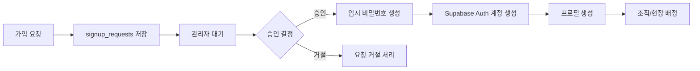
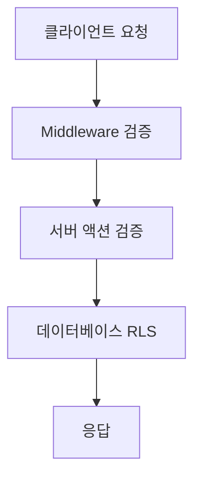

# 🔐 로그인 인증 및 권한 관리 시스템 분석 보고서

> 작성일: 2025-09-17  
> 작성자: David Yang  
> 프로젝트: INOPNC_WM_20250829

## 목차

1. [인증 시스템 구조](#1-인증-시스템-구조)
2. [사용자 역할 체계](#2-사용자-역할-체계)
3. [인증 플로우](#3-인증-플로우)
4. [권한 관리 시스템](#4-권한-관리-시스템)
5. [회원가입 승인 시스템](#5-회원가입-승인-시스템)
6. [보안 이벤트 로깅](#6-보안-이벤트-로깅)
7. [공개/보호 경로](#7-공개보호-경로)
8. [주요 보안 특징](#8-주요-보안-특징)

---

## 1. 인증 시스템 구조

### 핵심 컴포넌트

| 컴포넌트                | 파일 경로                             | 역할                            |
| ----------------------- | ------------------------------------- | ------------------------------- |
| **Supabase Auth**       | `@supabase/ssr`                       | 메인 인증 백엔드                |
| **Middleware**          | `middleware.ts:22-315`                | 모든 요청에 대한 인증/권한 검증 |
| **Auth Actions**        | `app/auth/actions.ts`                 | 서버 사이드 인증 액션           |
| **UnifiedAuthProvider** | `providers/unified-auth-provider.tsx` | 클라이언트 상태 관리            |

### 보안 기능

#### 1) 개발/운영 환경 분리 (`middleware.ts:24-32`)

```typescript
// CRITICAL SECURITY CHECK: Ensure auth bypass is NEVER active in production
if (process.env.NODE_ENV === 'production' && process.env.NEXT_PUBLIC_DEV_AUTH_BYPASS === 'true') {
  console.error('🚨 CRITICAL SECURITY ERROR: Dev auth bypass is enabled in production!')
  process.env.NEXT_PUBLIC_DEV_AUTH_BYPASS = 'false'
}
```

#### 2) 캐시 방지 (`middleware.ts:73-85`)

- 모든 페이지에 aggressive cache prevention 헤더 적용
- CDN 캐시 차단 (Cloudflare, Vercel 등)
- 타임스탬프 헤더로 유니크 응답 보장

#### 3) CSRF 공격 방어 (`middleware.ts:210-239`)

- Origin/Referer 헤더 검증
- POST, PUT, DELETE, PATCH 요청 보호
- 허용된 도메인 리스트 검증

#### 4) 보안 헤더 (`middleware.ts:176-202`)

```typescript
// Security headers
response.headers.set('X-Frame-Options', 'DENY')
response.headers.set('X-Content-Type-Options', 'nosniff')
response.headers.set('X-XSS-Protection', '1; mode=block')
response.headers.set('Referrer-Policy', 'strict-origin-when-cross-origin')
response.headers.set('Content-Security-Policy', csp)
response.headers.set('Strict-Transport-Security', 'max-age=31536000; includeSubDomains')
```

---

## 2. 사용자 역할 체계

### 역할 정의 (`types/index.ts:1-7`)

```typescript
export type UserRole = 'worker' | 'site_manager' | 'customer_manager' | 'admin' | 'system_admin'
```

### 역할별 권한 매트릭스

| 역할                 | 한글명        | UI 접근     | 주요 권한                                              | 기본 경로            |
| -------------------- | ------------- | ----------- | ------------------------------------------------------ | -------------------- |
| **worker**           | 작업자        | 모바일 UI   | • 작업일지 작성<br>• 출근정보 입력<br>• 개인 정보 조회 | `/mobile`            |
| **site_manager**     | 현장관리자    | 모바일 UI   | • 현장 관리<br>• 작업 승인<br>• 작업자 관리            | `/mobile`            |
| **customer_manager** | 고객사 관리자 | 모바일 UI   | • 고객사 데이터 조회<br>• 보고서 확인                  | `/partner/dashboard` |
| **admin**            | 본사관리자    | 데스크탑 UI | • 전체 시스템 관리<br>• 사용자 관리<br>• 데이터 분석   | `/dashboard/admin`   |
| **system_admin**     | 시스템관리자  | 데스크탑 UI | • (admin으로 통합 예정)<br>• 최고 권한                 | `/dashboard/admin`   |

---

## 3. 인증 플로우

### 로그인 프로세스 (`app/auth/actions.ts:9-146`)



#### 상세 단계

1. **인증 요청**

   ```typescript
   const { data, error } = await supabase.auth.signInWithPassword({
     email,
     password,
   })
   ```

2. **프로필 업데이트**

   ```typescript
   await supabase.from('profiles').update({
     last_login_at: new Date().toISOString(),
     login_count: (profile.login_count || 0) + 1,
   })
   ```

3. **역할 기반 라우팅**
   ```typescript
   const roleRoutes: Record<string, string> = {
     system_admin: '/dashboard/admin',
     admin: '/dashboard/admin',
     customer_manager: '/partner/dashboard',
     partner: '/partner/dashboard',
     site_manager: '/mobile',
     worker: '/mobile',
   }
   ```

### 세션 관리

#### 토큰 만료 시간 (`middleware.ts:105-109`)

| 토큰 유형     | 만료 시간 | 용도           |
| ------------- | --------- | -------------- |
| Refresh Token | 30일      | 장기 인증 유지 |
| Auth Token    | 7일       | 중기 세션 관리 |
| Access Token  | 1일       | 단기 API 접근  |

#### 세션 검증 (`middleware.ts:120-132`)

- 매 요청마다 세션 유효성 검사
- 유효하지 않은 세션 자동 쿠키 삭제
- 인증되지 않은 접근 시 로그인 페이지로 리다이렉트

---

## 4. 권한 관리 시스템

### 미들웨어 레벨 권한 체크

#### 역할별 라우팅 (`middleware.ts:253-262`)

```typescript
const roleRoutes: Record<string, string> = {
  system_admin: '/dashboard/admin',
  admin: '/dashboard/admin',
  customer_manager: '/partner/dashboard',
  partner: '/partner/dashboard',
  site_manager: '/mobile',
  worker: '/mobile',
}
```

### UnifiedAuthProvider 권한 플래그

#### 권한 체크 플래그 (`providers/unified-auth-provider.tsx:37-44`)

| 플래그              | 설명                      | 적용 역할                              |
| ------------------- | ------------------------- | -------------------------------------- |
| `canAccessMobile`   | 모바일 UI 접근 가능       | worker, site_manager, customer_manager |
| `canAccessAdmin`    | 관리자 대시보드 접근 가능 | admin, system_admin                    |
| `isWorker`          | 작업자 권한               | worker                                 |
| `isSiteManager`     | 현장관리자 권한           | site_manager                           |
| `isCustomerManager` | 고객사 관리자 권한        | customer_manager                       |
| `isAdmin`           | 관리자 권한               | admin                                  |
| `isSystemAdmin`     | 시스템 관리자 권한        | system_admin                           |

---

## 5. 회원가입 승인 시스템

### 승인 프로세스 (`app/auth/actions.ts:446-688`)



### 주요 기능

1. **가입 요청 제출**
   - 이메일 중복 확인
   - signup_requests 테이블에 저장
   - 상태: 'pending'

2. **관리자 승인 처리**
   - 임시 비밀번호 자동 생성
   - 역할 기반 권한 설정
   - 조직 및 현장 자동 배정

3. **거절 처리**
   - 거절 사유 기록
   - 거절 시각 및 관리자 ID 저장

---

## 6. 보안 이벤트 로깅

### 로깅 시스템 (`middleware.ts:6-20`)

#### 로깅 이벤트 유형

| 이벤트                        | 설명                 | 수집 데이터                |
| ----------------------------- | -------------------- | -------------------------- |
| `UNAUTHORIZED_ACCESS_ATTEMPT` | 권한 없는 접근 시도  | IP, UserAgent, 경로, 시간  |
| `CSRF_ATTACK_DETECTED`        | CSRF 공격 감지       | Origin, Referer, 메소드    |
| `ROLE_BASED_REDIRECT`         | 역할 기반 리다이렉션 | 사용자 ID, 역할, 대상 경로 |
| `AUTHENTICATED_ACCESS`        | 인증된 접근          | 사용자 ID, 세션 만료 시간  |

#### 로그 데이터 구조

```typescript
{
  timestamp: "2025-09-17T10:30:00.000Z",
  event: "AUTHENTICATED_ACCESS",
  ip: "192.168.1.1",
  userAgent: "Mozilla/5.0...",
  path: "/mobile",
  userId: "uuid",
  userEmail: "user@example.com",
  sessionExpiry: "2025-09-18T10:30:00.000Z"
}
```

---

## 7. 공개/보호 경로

### 공개 경로 (인증 불필요)

| 경로                   | 설명              |
| ---------------------- | ----------------- |
| `/`                    | 홈페이지          |
| `/auth/login`          | 로그인 페이지     |
| `/auth/reset-password` | 비밀번호 재설정   |
| `/auth/callback`       | OAuth 콜백        |
| `/_next/*`             | Next.js 정적 자원 |
| `/api/*`               | API 엔드포인트    |

### 보호 경로 (인증 필요)

| 경로 패턴            | 접근 가능 역할            | 설명            |
| -------------------- | ------------------------- | --------------- |
| `/mobile/*`          | worker, site_manager      | 모바일 작업 UI  |
| `/dashboard/admin/*` | admin, system_admin       | 관리자 대시보드 |
| `/partner/*`         | customer_manager, partner | 파트너 대시보드 |

---

## 8. 주요 보안 특징

### 다중 레이어 보안



### 핵심 보안 기능

#### 1) 역할 기반 접근 제어 (RBAC)

- 역할별 UI 완전 분리 (모바일/데스크탑)
- 세밀한 기능별 권한 제어
- 동적 권한 체크

#### 2) 세션 관리

- 자동 세션 갱신
- 타임아웃 관리 (3초 프로필 fetch)
- 만료 전 사전 갱신

#### 3) 에러 처리 및 복구

- 프로필 로드 실패 시 기본값 제공
- 네트워크 오류 시 graceful degradation
- 재시도 로직 구현

#### 4) 개발/운영 분리

- 개발 환경 전용 인증 우회
- 운영 환경 자동 보안 강화
- 환경별 설정 자동화

### 보안 체크리스트

- [x] HTTPS 강제 (HSTS)
- [x] CSRF 토큰 검증
- [x] XSS 방어 (CSP)
- [x] SQL Injection 방어 (Prepared Statements)
- [x] 세션 고정 공격 방어
- [x] 클릭재킹 방어 (X-Frame-Options)
- [x] 캐시 포이즈닝 방어
- [x] 타이밍 공격 방어

---

## 부록: 주요 파일 참조

| 파일                                  | 설명            | 주요 기능                       |
| ------------------------------------- | --------------- | ------------------------------- |
| `middleware.ts`                       | 미들웨어        | 인증 검증, 권한 체크, 보안 헤더 |
| `app/auth/actions.ts`                 | 인증 액션       | 로그인, 로그아웃, 회원가입      |
| `providers/unified-auth-provider.tsx` | 인증 프로바이더 | 클라이언트 상태 관리            |
| `types/index.ts`                      | 타입 정의       | UserRole, Profile 인터페이스    |
| `lib/supabase/server.ts`              | 서버 클라이언트 | 서버사이드 Supabase 접근        |
| `lib/supabase/client.ts`              | 클라이언트      | 클라이언트 Supabase 접근        |

---

> 📝 **Note**: 이 문서는 2025-09-17 기준으로 작성되었으며, 시스템 업데이트에 따라 내용이 변경될 수 있습니다.
