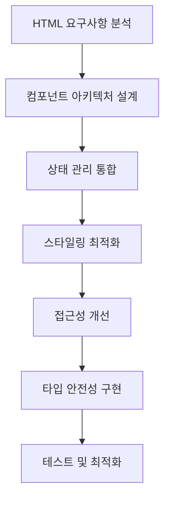

# HTML to React Migration Guide

> **작성일:** 2025-09-17  
> **프로젝트:** INOPNC Work Management System  
> **목적:** HTML 요구사항을 React 컴포넌트로 마이그레이션하는 최적화된 방법론

## 📋 목차

1. [마이그레이션 전략 개요](#마이그레이션-전략-개요)
2. [1단계: 컴포넌트 아키텍처 설계](#1단계-컴포넌트-아키텍처-설계)
3. [2단계: 상태 관리 통합](#2단계-상태-관리-통합)
4. [3단계: 스타일링 최적화](#3단계-스타일링-최적화)
5. [4단계: 접근성 개선](#4단계-접근성-개선)
6. [5단계: 타입 안전성 구현](#5단계-타입-안전성-구현)
7. [실제 사례 연구](#실제-사례-연구)
8. [성능 최적화 가이드](#성능-최적화-가이드)
9. [유틸리티 함수](#유틸리티-함수)

---

## 마이그레이션 전략 개요

### 🎯 현재 프로젝트 환경

- **Framework:** Next.js 14.2.3 (App Router)
- **UI Library:** React 18
- **언어:** TypeScript
- **스타일링:** Tailwind CSS
- **컴포넌트 라이브러리:** Radix UI
- **백엔드:** Supabase
- **상태 관리:** React Query (@tanstack/react-query)

### 🛠️ 5단계 마이그레이션 전략



---

## 1단계: 컴포넌트 아키텍처 설계

### 📐 HTML 구조 분석 및 컴포넌트 분해

#### Before: HTML 구조

```html
<!-- HTML 요구사항 예시 -->
<div class="sidebar-container">
  <div class="overlay" onclick="closeSidebar()"></div>
  <nav class="sidebar">
    <div class="sidebar-header">
      <h2>메뉴</h2>
      <button class="close-btn" onclick="closeSidebar()">×</button>
    </div>
    <ul class="menu-list">
      <li><a href="/dashboard">대시보드</a></li>
      <li><a href="/reports">보고서</a></li>
    </ul>
  </nav>
</div>
```

#### After: React 컴포넌트 구조

```tsx
// components/Sidebar/Sidebar.tsx
interface SidebarProps {
  isOpen: boolean
  onClose: () => void
  menuItems: MenuItem[]
}

export function Sidebar({ isOpen, onClose, menuItems }: SidebarProps) {
  return (
    <div className={cn('sidebar-container', { 'is-open': isOpen })}>
      <SidebarOverlay isOpen={isOpen} onClick={onClose} />
      <SidebarNav isOpen={isOpen}>
        <SidebarHeader onClose={onClose} />
        <SidebarMenu items={menuItems} onClose={onClose} />
      </SidebarNav>
    </div>
  )
}

// components/Sidebar/SidebarOverlay.tsx
interface SidebarOverlayProps {
  isOpen: boolean
  onClick: () => void
}

function SidebarOverlay({ isOpen, onClick }: SidebarOverlayProps) {
  return (
    <div
      className={cn(
        'fixed inset-0 bg-black/50 transition-opacity z-40',
        isOpen ? 'opacity-100' : 'opacity-0 pointer-events-none'
      )}
      onClick={onClick}
      aria-hidden="true"
    />
  )
}
```

### 🏗️ 컴포넌트 분해 원칙

1. **단일 책임 원칙**: 각 컴포넌트는 하나의 명확한 역할
2. **재사용 가능성**: 여러 곳에서 사용할 수 있도록 설계
3. **조합 가능성**: 작은 컴포넌트들을 조합하여 복잡한 UI 구성
4. **명확한 인터페이스**: Props와 callbacks를 통한 명확한 API

---

## 2단계: 상태 관리 통합

### 🔄 HTML 이벤트 → React 상태 관리

#### Before: HTML JavaScript

```javascript
// HTML에서의 전역 변수와 함수
let sidebarOpen = false

function toggleSidebar() {
  sidebarOpen = !sidebarOpen
  updateSidebarUI()
}

function closeSidebar() {
  sidebarOpen = false
  updateSidebarUI()
}
```

#### After: React Hooks

```tsx
// hooks/useSidebar.ts
export function useSidebar() {
  const [isOpen, setIsOpen] = useState(false)

  const toggle = useCallback(() => {
    setIsOpen(prev => !prev)
  }, [])

  const close = useCallback(() => {
    setIsOpen(false)
  }, [])

  const open = useCallback(() => {
    setIsOpen(true)
  }, [])

  // 모바일에서 메뉴 항목 클릭 시 자동 닫기
  useEffect(() => {
    const isMobile = window.innerWidth < 768
    if (isMobile && isOpen) {
      const timer = setTimeout(close, 100)
      return () => clearTimeout(timer)
    }
  }, [isOpen, close])

  return { isOpen, toggle, close, open }
}
```

### 📊 복잡한 상태 관리

#### 폼 상태 관리 예시

```tsx
// hooks/useFormState.ts
interface FormState {
  data: Record<string, any>
  errors: Record<string, string>
  isSubmitting: boolean
}

export function useFormState<T>(initialData: T) {
  const [state, dispatch] = useReducer(formReducer, {
    data: initialData,
    errors: {},
    isSubmitting: false,
  })

  const setField = useCallback((field: keyof T, value: any) => {
    dispatch({ type: 'SET_FIELD', field, value })
  }, [])

  const setError = useCallback((field: keyof T, error: string) => {
    dispatch({ type: 'SET_ERROR', field, error })
  }, [])

  const clearErrors = useCallback(() => {
    dispatch({ type: 'CLEAR_ERRORS' })
  }, [])

  return { state, setField, setError, clearErrors }
}
```

---

## 3단계: 스타일링 최적화

### 🎨 HTML CSS → Tailwind CSS 변환

#### Before: HTML CSS

```css
.sidebar-container {
  position: fixed;
  top: 0;
  left: 0;
  width: 100%;
  height: 100%;
  z-index: 1000;
  pointer-events: none;
}

.sidebar-container.is-open {
  pointer-events: auto;
}

.sidebar {
  position: absolute;
  top: 0;
  left: 0;
  width: 280px;
  height: 100%;
  background: white;
  transform: translateX(-100%);
  transition: transform 0.3s ease;
}

.sidebar.is-open {
  transform: translateX(0);
}
```

#### After: Tailwind CSS + CVA

```tsx
// utils/sidebar-variants.ts
import { cva } from 'class-variance-authority'

export const sidebarVariants = cva('fixed top-0 left-0 w-full h-full transition-all duration-300', {
  variants: {
    isOpen: {
      true: 'pointer-events-auto',
      false: 'pointer-events-none',
    },
    size: {
      sm: 'max-w-64',
      md: 'max-w-80',
      lg: 'max-w-96',
    },
  },
  defaultVariants: {
    isOpen: false,
    size: 'md',
  },
})

export const sidebarNavVariants = cva(
  'absolute top-0 left-0 h-full bg-white shadow-xl transition-transform duration-300 ease-in-out',
  {
    variants: {
      isOpen: {
        true: 'translate-x-0',
        false: '-translate-x-full',
      },
      position: {
        left: 'left-0',
        right: 'right-0 translate-x-full',
      },
    },
    defaultVariants: {
      isOpen: false,
      position: 'left',
    },
  }
)
```

### 📱 모바일 최적화 패턴

```tsx
// components/MobileOptimized.tsx
export function MobileOptimizedComponent() {
  return (
    <div
      className={cn(
        // 기본 스타일
        'relative w-full',
        // 모바일 우선 스타일
        'p-4 text-sm',
        // 태블릿 스타일
        'md:p-6 md:text-base',
        // 데스크톱 스타일
        'lg:p-8 lg:text-lg',
        // 터치 인터페이스 최적화
        'touch-manipulation',
        // 안전 영역 고려 (노치 대응)
        'pt-safe pb-safe pl-safe pr-safe'
      )}
    >
      {/* 컨텐츠 */}
    </div>
  )
}
```

---

## 4단계: 접근성 개선

### ♿ HTML → React 접근성 개선

#### Before: HTML 접근성 부족

```html
<div class="modal">
  <div class="modal-content">
    <span class="close">&times;</span>
    <p>Modal content</p>
  </div>
</div>
```

#### After: React 접근성 완전 구현

```tsx
// components/Modal/Modal.tsx
interface ModalProps {
  isOpen: boolean
  onClose: () => void
  title: string
  children: React.ReactNode
}

export function Modal({ isOpen, onClose, title, children }: ModalProps) {
  const modalRef = useRef<HTMLDivElement>(null)

  // ESC 키 처리
  useEffect(() => {
    const handleEscape = (event: KeyboardEvent) => {
      if (event.key === 'Escape' && isOpen) {
        onClose()
      }
    }

    document.addEventListener('keydown', handleEscape)
    return () => document.removeEventListener('keydown', handleEscape)
  }, [isOpen, onClose])

  // 포커스 트랩
  useFocusTrap(modalRef, isOpen)

  return (
    <div
      ref={modalRef}
      className={cn(
        'fixed inset-0 z-50 flex items-center justify-center',
        'bg-black/50 backdrop-blur-sm',
        isOpen ? 'opacity-100' : 'opacity-0 pointer-events-none'
      )}
      role="dialog"
      aria-modal="true"
      aria-labelledby="modal-title"
      aria-describedby="modal-description"
      onClick={e => {
        if (e.target === e.currentTarget) onClose()
      }}
    >
      <div
        className={cn(
          'relative bg-white rounded-lg shadow-xl',
          'max-w-md w-full mx-4 p-6',
          'transform transition-all duration-200',
          isOpen ? 'scale-100' : 'scale-95'
        )}
        onClick={e => e.stopPropagation()}
      >
        <div className="flex items-center justify-between mb-4">
          <h2 id="modal-title" className="text-lg font-semibold text-gray-900">
            {title}
          </h2>
          <button
            type="button"
            onClick={onClose}
            className={cn(
              'rounded-md p-2 text-gray-400 hover:text-gray-600',
              'hover:bg-gray-100 focus:outline-none focus:ring-2',
              'focus:ring-blue-500 focus:ring-offset-2'
            )}
            aria-label="모달 닫기"
          >
            <X className="h-5 w-5" />
          </button>
        </div>
        <div id="modal-description">{children}</div>
      </div>
    </div>
  )
}

// hooks/useFocusTrap.ts
function useFocusTrap(ref: RefObject<HTMLElement>, isActive: boolean) {
  useEffect(() => {
    if (!isActive || !ref.current) return

    const focusableElements = ref.current.querySelectorAll(
      'button, [href], input, select, textarea, [tabindex]:not([tabindex="-1"])'
    )

    const firstElement = focusableElements[0] as HTMLElement
    const lastElement = focusableElements[focusableElements.length - 1] as HTMLElement

    const handleTabKey = (e: KeyboardEvent) => {
      if (e.key !== 'Tab') return

      if (e.shiftKey) {
        if (document.activeElement === firstElement) {
          e.preventDefault()
          lastElement.focus()
        }
      } else {
        if (document.activeElement === lastElement) {
          e.preventDefault()
          firstElement.focus()
        }
      }
    }

    firstElement?.focus()
    document.addEventListener('keydown', handleTabKey)

    return () => {
      document.removeEventListener('keydown', handleTabKey)
    }
  }, [ref, isActive])
}
```

### 🏷️ ARIA 속성 매핑 가이드

| HTML 패턴                      | React + ARIA                                   |
| ------------------------------ | ---------------------------------------------- |
| `<div onclick="...">`          | `<button type="button" onClick={...} />`       |
| `<span class="close">×</span>` | `<button aria-label="닫기"><X /></button>`     |
| `<div class="modal">`          | `<div role="dialog" aria-modal="true">`        |
| `<ul class="menu">`            | `<nav role="navigation" aria-label="주 메뉴">` |

---

## 5단계: 타입 안전성 구현

### 🔒 TypeScript 인터페이스 정의

```tsx
// types/ui.ts
export interface BaseComponentProps {
  className?: string
  children?: React.ReactNode
  'data-testid'?: string
}

export interface SidebarProps extends BaseComponentProps {
  isOpen: boolean
  onClose: () => void
  position?: 'left' | 'right'
  size?: 'sm' | 'md' | 'lg'
  overlay?: boolean
}

export interface MenuItem {
  id: string
  label: string
  href?: string
  onClick?: () => void
  icon?: React.ComponentType<{ className?: string }>
  badge?: string | number
  disabled?: boolean
  subItems?: MenuItem[]
}

// types/forms.ts
export interface FormField<T = any> {
  value: T
  error?: string
  touched?: boolean
  dirty?: boolean
}

export interface FormState<T extends Record<string, any> = Record<string, any>> {
  fields: { [K in keyof T]: FormField<T[K]> }
  isSubmitting: boolean
  isValid: boolean
}

// types/api.ts
export interface ApiResponse<T = any> {
  data?: T
  error?: string
  message?: string
  status: 'success' | 'error' | 'loading'
}

export interface PaginatedResponse<T = any> extends ApiResponse<T[]> {
  pagination: {
    page: number
    limit: number
    total: number
    pages: number
  }
}
```

### 🛡️ 타입 안전한 이벤트 처리

```tsx
// utils/event-handlers.ts
export type EventHandler<T = HTMLElement> = (
  event: React.MouseEvent<T> | React.KeyboardEvent<T>
) => void

export function createSafeClickHandler(
  handler: () => void,
  options?: {
    preventDefault?: boolean
    stopPropagation?: boolean
    disabled?: boolean
  }
): EventHandler {
  return event => {
    const { preventDefault = true, stopPropagation = true, disabled = false } = options || {}

    if (disabled) return

    if (preventDefault) event.preventDefault()
    if (stopPropagation) event.stopPropagation()

    handler()
  }
}

// 사용 예시
export function Button({ onClick, disabled, children }: ButtonProps) {
  const handleClick = createSafeClickHandler(onClick, { disabled })

  return (
    <button
      type="button"
      onClick={handleClick}
      disabled={disabled}
      className={buttonVariants({ disabled })}
    >
      {children}
    </button>
  )
}
```

---

## 실제 사례 연구

### 📱 Partner Sidebar 모바일 최적화 사례

#### 문제점 분석

- **Z-index 충돌**: 높은 z-index 값 (100, 110, 120)으로 인한 레이어링 문제
- **setTimeout 남용**: 불필요한 비동기 래퍼로 인한 성능 저하
- **모바일 터치 이벤트 미최적화**: 터치 인터페이스 고려 부족

#### 해결 방안

```tsx
// Before: 문제가 있던 구현
function ProblematicSidebar({ isOpen, onClose }) {
  return (
    <div className="fixed inset-0 z-[100]">
      <nav className="absolute left-0 top-0 h-full w-80 bg-white z-[110]">
        <button
          className="z-[120]"
          onClick={e => {
            e.preventDefault()
            setTimeout(() => onClose(), 0) // 불필요한 setTimeout
          }}
        >
          ×
        </button>
      </nav>
    </div>
  )
}

// After: 최적화된 구현
function OptimizedSidebar({ isOpen, onClose }: SidebarProps) {
  return (
    <div
      className={sidebarVariants({ isOpen })}
      style={{ transform: isOpen ? 'translateX(0)' : 'translateX(-100%)' }}
      {...(!isOpen && { inert: true })} // 접근성 개선
    >
      <div className="fixed inset-0 bg-black/50 z-40" onClick={onClose} aria-hidden="true" />
      <nav className="absolute left-0 top-0 h-full w-80 bg-white shadow-xl z-50">
        <button
          type="button"
          onClick={e => {
            e.preventDefault()
            e.stopPropagation()
            if (typeof onClose === 'function') {
              onClose() // 직접 호출
            }
          }}
          className={cn(
            'absolute top-4 right-4 p-2',
            'text-gray-500 hover:text-gray-700',
            'focus:outline-none focus:ring-2 focus:ring-blue-500'
          )}
          aria-label="사이드바 닫기"
        >
          <X className="h-5 w-5" />
        </button>
      </nav>
    </div>
  )
}
```

### 🎯 개선 결과

- **성능**: setTimeout 제거로 응답성 개선
- **일관성**: Manager sidebar와 동일한 z-index 체계
- **접근성**: ARIA 속성 및 키보드 네비게이션 지원
- **모바일**: 터치 이벤트 최적화 및 안전 영역 고려

---

## 성능 최적화 가이드

### ⚡ React 성능 최적화 패턴

#### 1. 메모이제이션 활용

```tsx
// components/OptimizedComponent.tsx
const ExpensiveComponent = memo(function ExpensiveComponent({
  data,
  onAction,
}: ExpensiveComponentProps) {
  // 복잡한 계산이 포함된 컴포넌트
  const processedData = useMemo(() => {
    return data.map(item => ({
      ...item,
      computed: expensiveCalculation(item),
    }))
  }, [data])

  const handleAction = useCallback(
    (id: string) => {
      onAction(id)
    },
    [onAction]
  )

  return (
    <div>
      {processedData.map(item => (
        <ExpensiveItem key={item.id} data={item} onAction={handleAction} />
      ))}
    </div>
  )
})
```

#### 2. 레이지 로딩 구현

```tsx
// components/LazyComponents.tsx
const LazyModal = lazy(() => import('./Modal/Modal'))
const LazyChart = lazy(() => import('./Chart/Chart'))

export function LazyLoadedComponent() {
  const [showModal, setShowModal] = useState(false)

  return (
    <div>
      {showModal && (
        <Suspense fallback={<ModalSkeleton />}>
          <LazyModal onClose={() => setShowModal(false)} />
        </Suspense>
      )}

      <Suspense fallback={<ChartSkeleton />}>
        <LazyChart data={data} />
      </Suspense>
    </div>
  )
}
```

#### 3. 가상화 구현

```tsx
// components/VirtualizedList.tsx
import { FixedSizeList as List } from 'react-window'

export function VirtualizedList({ items }: { items: any[] }) {
  const Row = ({ index, style }: { index: number; style: any }) => (
    <div style={style}>
      <ListItem data={items[index]} />
    </div>
  )

  return (
    <List height={400} itemCount={items.length} itemSize={60} overscanCount={5}>
      {Row}
    </List>
  )
}
```

---

## 유틸리티 함수

### 🔧 마이그레이션 도우미 함수

```tsx
// utils/migration-helpers.ts

/**
 * HTML 클래스명을 Tailwind CSS 클래스로 변환
 */
export function convertClassNames(htmlClasses: string): string {
  const classMap: Record<string, string> = {
    'display-none': 'hidden',
    'display-block': 'block',
    'display-flex': 'flex',
    'text-center': 'text-center',
    'text-left': 'text-left',
    'text-right': 'text-right',
    'float-left': 'float-left',
    'float-right': 'float-right',
    'position-relative': 'relative',
    'position-absolute': 'absolute',
    'position-fixed': 'fixed',
  }

  return htmlClasses
    .split(' ')
    .map(cls => classMap[cls] || cls)
    .join(' ')
}

/**
 * HTML 인라인 스타일을 Tailwind CSS 클래스로 변환
 */
export function convertInlineStyles(style: string): string {
  const styles = style.split(';').filter(Boolean)
  const tailwindClasses: string[] = []

  styles.forEach(styleDecl => {
    const [property, value] = styleDecl.split(':').map(s => s.trim())

    switch (property) {
      case 'display':
        if (value === 'none') tailwindClasses.push('hidden')
        if (value === 'block') tailwindClasses.push('block')
        if (value === 'flex') tailwindClasses.push('flex')
        break
      case 'position':
        tailwindClasses.push(value)
        break
      case 'z-index':
        tailwindClasses.push(`z-[${value}]`)
        break
    }
  })

  return tailwindClasses.join(' ')
}

/**
 * HTML 이벤트 핸들러를 React 이벤트 핸들러로 변환
 */
export function createEventHandler(
  originalHandler: string,
  context: Record<string, any>
): React.EventHandler<any> {
  return event => {
    event.preventDefault()
    event.stopPropagation()

    // 원본 핸들러 실행 (보안상 주의 필요)
    if (typeof context[originalHandler] === 'function') {
      context[originalHandler]()
    }
  }
}

/**
 * HTML 폼을 React 형식으로 변환
 */
export function convertFormData(formElement: HTMLFormElement): Record<string, any> {
  const formData = new FormData(formElement)
  const result: Record<string, any> = {}

  formData.forEach((value, key) => {
    if (result[key]) {
      // 배열로 변환
      if (Array.isArray(result[key])) {
        result[key].push(value)
      } else {
        result[key] = [result[key], value]
      }
    } else {
      result[key] = value
    }
  })

  return result
}

/**
 * 반응형 브레이크포인트 유틸리티
 */
export function useBreakpoint() {
  const [breakpoint, setBreakpoint] = useState<'sm' | 'md' | 'lg' | 'xl'>('md')

  useEffect(() => {
    const updateBreakpoint = () => {
      const width = window.innerWidth
      if (width < 640) setBreakpoint('sm')
      else if (width < 768) setBreakpoint('md')
      else if (width < 1024) setBreakpoint('lg')
      else setBreakpoint('xl')
    }

    updateBreakpoint()
    window.addEventListener('resize', updateBreakpoint)
    return () => window.removeEventListener('resize', updateBreakpoint)
  }, [])

  return breakpoint
}

/**
 * 터치 디바이스 감지
 */
export function useTouch() {
  const [isTouch, setIsTouch] = useState(false)

  useEffect(() => {
    setIsTouch(
      'ontouchstart' in window || navigator.maxTouchPoints > 0 || navigator.msMaxTouchPoints > 0
    )
  }, [])

  return isTouch
}
```

---

## 📚 추가 참고 자료

### 🔗 유용한 링크

- [Next.js App Router 가이드](https://nextjs.org/docs/app)
- [Tailwind CSS 공식 문서](https://tailwindcss.com/docs)
- [Radix UI 컴포넌트](https://www.radix-ui.com/docs)
- [React Query 가이드](https://tanstack.com/query/latest)
- [ARIA 접근성 가이드](https://developer.mozilla.org/en-US/docs/Web/Accessibility/ARIA)

### 📋 체크리스트

#### 마이그레이션 완료 체크리스트

- [ ] 컴포넌트 분해 및 재사용성 확인
- [ ] 타입 안전성 구현 (TypeScript 인터페이스)
- [ ] 접근성 속성 추가 (ARIA, 키보드 네비게이션)
- [ ] 모바일 최적화 (터치 인터페이스, 반응형 디자인)
- [ ] 성능 최적화 (메모이제이션, 레이지 로딩)
- [ ] 테스트 케이스 작성
- [ ] 브라우저 호환성 테스트
- [ ] 실제 디바이스 테스트

#### 코드 품질 체크리스트

- [ ] ESLint 규칙 통과
- [ ] Prettier 포맷팅 적용
- [ ] 타입 체크 통과 (`npm run type-check`)
- [ ] 테스트 통과 (`npm run test`)
- [ ] 빌드 성공 (`npm run build`)

---

## 🎯 결론

HTML 요구사항을 React로 마이그레이션하는 과정은 단순한 문법 변환을 넘어서 다음과 같은 가치를 제공합니다:

1. **타입 안전성**: TypeScript를 통한 컴파일 타임 오류 방지
2. **재사용성**: 컴포넌트 기반 아키텍처로 코드 재사용성 향상
3. **성능**: React의 Virtual DOM과 최적화 기법 활용
4. **접근성**: 웹 접근성 표준 준수로 더 나은 사용자 경험 제공
5. **유지보수성**: 명확한 구조와 타입 시스템으로 유지보수 용이성 향상

이 가이드를 따라 체계적으로 마이그레이션을 진행하면, 현대적이고 확장 가능한 React 애플리케이션을 구축할 수 있습니다.

---

> **⚠️ 주의사항**
>
> - 보안에 민감한 코드 변경 전에는 `npm run test:critical` 실행 필수
> - 보호된 파일(`/lib/supabase/server.ts`, `/lib/supabase/client.ts`, `/middleware.ts`, `/app/auth/actions.ts`) 수정 시 특별한 주의 필요
> - 모든 변경사항은 충분한 테스트 후 프로덕션 배포

**작성자:** Claude AI Assistant  
**최종 수정일:** 2025-09-17  
**버전:** 1.0.0
