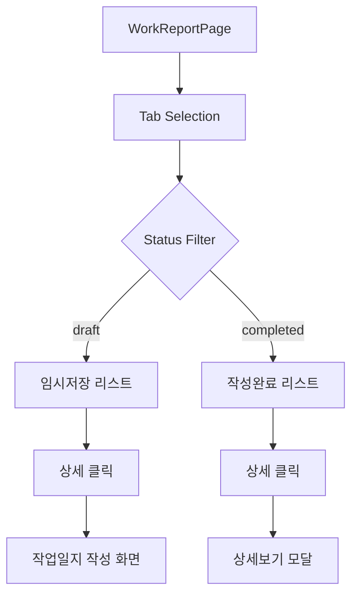

# 📋 작업일지 페이지 구현 계획서

**작성일**: 2025-09-17  
**작성자**: DY  
**참조 문서**: `/dy_memo/new_image_html_v2.0/html로 미리보기 화면/workreport.html`

## 🎯 **구현 목표**

HTML 참조 문서 기반으로 작업일지 관리 시스템을 React/Next.js 환경에서 완전히 구현

---

## 1️⃣ **탭 메뉴 시스템 구현**

### **컴포넌트 구조**

```typescript
// /modules/mobile/components/work-report/WorkReportTabs.tsx
interface TabConfig {
  id: 'draft' | 'completed'
  label: string
  count?: number
  color: string
}

const tabs: TabConfig[] = [
  { id: 'draft', label: '임시저장', color: '#FF2980' },
  { id: 'completed', label: '작성완료', color: '#14B8A6' },
]
```

### **구현 상세**

- **파일 위치**: `/modules/mobile/components/work-report/WorkReportTabs.tsx`
- **주요 기능**:
  - 활성 탭 상태 관리 (`useState`)
  - 탭 전환 시 URL 파라미터 업데이트 (`useSearchParams`)
  - 각 탭별 작업일지 개수 실시간 표시
  - 탭 색상 커스터마이징 (임시저장: 핑크, 완료: 초록)

### **상태 관리**

```typescript
// 탭 상태 타입 정의
type WorkReportStatus = 'draft' | 'completed'

// 탭 전환 핸들러
const handleTabChange = (status: WorkReportStatus) => {
  setActiveTab(status)
  router.push(`?tab=${status}`)
  // 리스트 필터링 트리거
}
```

---

## 2️⃣ **현장 검색 기능 구현**

### **컴포넌트 구조**

```typescript
// /modules/mobile/components/work-report/WorkReportSearch.tsx
interface SearchProps {
  onSearch: (query: string) => void
  placeholder?: string
}
```

### **구현 상세**

- **파일 위치**: `/modules/mobile/components/work-report/WorkReportSearch.tsx`
- **주요 기능**:
  - 실시간 검색 (debounce 300ms 적용)
  - 검색어 하이라이팅
  - 검색 결과 개수 표시
  - 검색 초기화 버튼

### **검색 로직**

```typescript
// 실시간 검색 구현
const debouncedSearch = useMemo(
  () =>
    debounce((query: string) => {
      filterWorkReports(query)
    }, 300),
  []
)

// 검색 필터링
const filterWorkReports = (query: string) => {
  const filtered = workReports.filter(report =>
    report.siteName.toLowerCase().includes(query.toLowerCase())
  )
  setFilteredReports(filtered)
}
```

---

## 3️⃣ **작업일지 리스트 및 카드 컴포넌트**

### **카드 컴포넌트 구조**

```typescript
// /modules/mobile/components/work-report/WorkReportCard.tsx
interface WorkReportCardProps {
  report: WorkReport
  status: 'draft' | 'completed'
  onDetailClick: (report: WorkReport) => void
}
```

### **구현 상세**

- **파일 위치**: `/modules/mobile/components/work-report/WorkReportCard.tsx`
- **카드 표시 정보**:
  - 현장명 (상단 굵은 글씨)
  - 작성자 정보
  - 작업일자
  - 상태 배지 (색상 구분)
  - 주요 작업 내용 미리보기

### **상세 버튼 동작 로직**

```typescript
const handleDetailClick = (report: WorkReport) => {
  if (report.status === 'draft') {
    // 임시저장 → 작업일지 작성 화면으로 이동
    router.push(`/mobile/worklog/edit/${report.id}`)
    // 로컬 스토리지에 임시 데이터 저장
    localStorage.setItem('draft_report', JSON.stringify(report))
  } else {
    // 작성완료 → 상세보기 모달 오픈
    setSelectedReport(report)
    setIsDetailModalOpen(true)
  }
}
```

---

## 4️⃣ **작업일지 상세보기 모달**

### **모달 컴포넌트 구조**

```typescript
// /modules/mobile/components/work-report/WorkReportDetailModal.tsx
interface DetailModalProps {
  report: WorkReport
  isOpen: boolean
  onClose: () => void
  readOnly: boolean
}
```

### **구현 상세**

- **파일 위치**: `/modules/mobile/components/work-report/WorkReportDetailModal.tsx`
- **주요 기능**:
  - 읽기 전용 모드로 전체 정보 표시
  - 첨부 사진 갤러리 (썸네일 + 확대 보기)
  - 작업 정보 섹션별 구분 표시
  - 모달 외부 클릭 시 닫기

### **사진 표시 구현**

```typescript
// 썸네일 갤러리 컴포넌트
const PhotoGallery = ({ photos }: { photos: string[] }) => (
  <div className="grid grid-cols-3 gap-2">
    {photos.map((photo, idx) => (
       openPhotoViewer(idx)}
      />
    ))}
  </div>
)
```

---

## 5️⃣ **바텀시트 (임시저장 수) 구현**

### **바텀시트 컴포넌트 구조**

```typescript
// /modules/mobile/components/work-report/DraftCountBottomSheet.tsx
interface BottomSheetProps {
  draftCount: number
  year: number
  month: number
  onDismiss: () => void
}
```

### **구현 상세**

- **파일 위치**: `/modules/mobile/components/work-report/DraftCountBottomSheet.tsx`
- **주요 기능**:
  - 임시저장 작업일지 개수 표시 (년/월별)
  - "오늘은 그만 보기" 체크박스
  - localStorage 활용 숨김 상태 저장
  - 슬라이드 업/다운 애니메이션

### **숨김 기능 구현**

```typescript
// 오늘 날짜 기준 숨김 처리
const handleDontShowToday = (checked: boolean) => {
  if (checked) {
    const tomorrow = new Date()
    tomorrow.setDate(tomorrow.getDate() + 1)
    tomorrow.setHours(0, 0, 0, 0)

    localStorage.setItem('hideDraftSheet', tomorrow.toISOString())
    setIsVisible(false)
  }
}

// 초기 로드 시 체크
useEffect(() => {
  const hideUntil = localStorage.getItem('hideDraftSheet')
  if (hideUntil && new Date(hideUntil) > new Date()) {
    setIsVisible(false)
  }
}, [])
```

---

## 6️⃣ **상태 표시 시스템**

### **스타일 정의**

```css
/* /modules/mobile/components/work-report/styles/status.css */
.status-badge-draft {
  background-color: #ff2980;
  color: white;
  padding: 4px 12px;
  border-radius: 12px;
  font-size: 12px;
}

.status-badge-completed {
  background-color: #14b8a6;
  color: white;
  padding: 4px 12px;
  border-radius: 12px;
  font-size: 12px;
}
```

---

## 📁 **파일 구조**

```
/modules/mobile/components/work-report/
├── WorkReportTabs.tsx          # 탭 메뉴 시스템
├── WorkReportSearch.tsx        # 검색 기능
├── WorkReportCard.tsx          # 작업일지 카드
├── WorkReportList.tsx          # 카드 리스트 컨테이너
├── WorkReportDetailModal.tsx   # 상세보기 모달
├── DraftCountBottomSheet.tsx   # 임시저장 바텀시트
├── styles/
│   ├── status.css              # 상태 표시 스타일
│   └── work-report.css         # 전체 스타일
└── hooks/
    ├── useWorkReports.ts       # 데이터 fetching
    └── useDraftVisibility.ts  # 바텀시트 표시 로직
```

---

## 🔄 **데이터 플로우**



---

## 📊 **데이터 타입 정의**

```typescript
// types/work-report.types.ts
interface WorkReport {
  id: string
  siteName: string
  workDate: string
  author: string
  buildingName: string
  workProcess: string
  workType: string
  block: string
  dong: string
  ho: string
  manHours: number
  status: 'draft' | 'completed'
  photos: string[]
  drawings: string[]
  completionDocs: string[]
  npcData: {
    inbound: string
    used: string
    stock: string
  }
  createdAt: Date
  updatedAt: Date
}

interface DraftSummary {
  year: number
  month: number
  count: number
  lastUpdated: Date
}
```

---

## ⚡ **구현 우선순위**

### **Phase 1** (핵심 기능) - 1주차

1. 탭 메뉴 시스템 구현
2. 작업일지 카드 컴포넌트 개발
3. 상태별 필터링 로직 구현

### **Phase 2** (상호작용) - 2주차

1. 검색 기능 구현
2. 상세보기 모달 개발
3. 임시저장 → 편집 화면 이동 로직

### **Phase 3** (부가 기능) - 3주차

1. 바텀시트 구현
2. localStorage 활용 상태 저장
3. 애니메이션 및 트랜지션 적용

---

## 🔗 **API 엔드포인트**

```typescript
// 필요한 API 엔드포인트
GET  /api/work-reports?status={draft|completed}&search={query}
GET  /api/work-reports/{id}
POST /api/work-reports/draft-count
PUT  /api/work-reports/{id}
DELETE /api/work-reports/{id}
```

---

## 🧪 **테스트 계획**

### **단위 테스트**

- 각 컴포넌트별 렌더링 테스트
- 상태 변경 로직 테스트
- 검색 필터링 로직 테스트

### **통합 테스트**

- 탭 전환 → 데이터 필터링 플로우
- 임시저장 → 편집 화면 이동 플로우
- 상세보기 모달 오픈/클로즈

### **E2E 테스트**

- 전체 작업일지 작성 → 저장 → 조회 플로우
- 검색 → 필터링 → 상세보기 플로우

---

## 📝 **주의사항**

1. **성능 최적화**
   - 리스트 가상화 (react-window) 적용 검토
   - 이미지 lazy loading 구현
   - 검색 debounce 적용

2. **접근성**
   - ARIA 레이블 적용
   - 키보드 네비게이션 지원
   - 스크린 리더 호환성

3. **반응형 디자인**
   - 모바일 퍼스트 접근
   - 태블릿/데스크톱 대응

---

## 🚀 **배포 체크리스트**

- [ ] 모든 컴포넌트 구현 완료
- [ ] API 연동 완료
- [ ] 테스트 커버리지 80% 이상
- [ ] 성능 최적화 완료
- [ ] 접근성 검토 완료
- [ ] 코드 리뷰 완료
- [ ] 문서화 완료

---

**마지막 업데이트**: 2025-09-17
