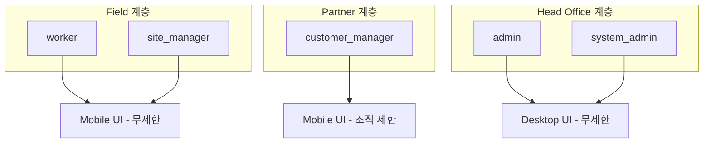

# 🔄 인증 시스템 단순화 계획

> 작성일: 2025-09-17  
> 작성자: David Yang  
> 목적: 5-역할 시스템에서 3-계층 구조로 단순화

## 📋 요약

현재의 5개 역할 시스템을 3개 계층으로 단순화하여 인증 및 권한 관리의 복잡도를 크게 감소시킵니다.

### 핵심 변경사항

- **역할 통합**: 5개 역할 → 3개 계층
- **접근 제어 단순화**: Partner 계층만 조직 기반 제한
- **코드 복잡도 감소**: 약 40% 감소 예상

## 🎯 목표 아키텍처

### 3-계층 구조



### 계층별 특성

| 계층            | 현재 역할            | UI 접근    | 데이터 접근        | 제한사항          |
| --------------- | -------------------- | ---------- | ------------------ | ----------------- |
| **Field**       | worker, site_manager | Mobile UI  | 모든 현장/시공업체 | ❌ 없음           |
| **Partner**     | customer_manager     | Mobile UI  | 자신의 조직만      | ✅ 조직 기반 제한 |
| **Head Office** | admin, system_admin  | Desktop UI | 모든 데이터        | ❌ 없음           |

## 🔧 구현 계획

### Phase 1: 타입 시스템 단순화 (1주)

#### 1.1 새로운 타입 정의

```typescript
// types/auth.ts
export type UserTier = 'field' | 'partner' | 'head_office'

export interface SimplifiedAuthContext {
  // Core
  user: User | null
  profile: Profile | null

  // Tier-based access
  tier: UserTier | null
  isFieldTier: boolean
  isPartnerTier: boolean
  isHeadOfficeTier: boolean

  // Organization restriction (Partner only)
  organizationId?: string
  canAccessOrganization: (orgId: string) => boolean
}
```

#### 1.2 역할-계층 매핑

```typescript
const ROLE_TO_TIER_MAP: Record<UserRole, UserTier> = {
  worker: 'field',
  site_manager: 'field',
  customer_manager: 'partner',
  admin: 'head_office',
  system_admin: 'head_office',
}
```

### Phase 2: UnifiedAuthProvider 개선 (3일)

#### 2.1 계층 기반 로직 추가

```typescript
// providers/unified-auth-provider.tsx 수정
export function UnifiedAuthProvider({ children }: Props) {
  // 기존 상태 유지
  const [user, setUser] = useState<User | null>(null)
  const [profile, setProfile] = useState<Profile | null>(null)

  // 계층 계산
  const tier = useMemo(() => {
    if (!profile?.role) return null
    return ROLE_TO_TIER_MAP[profile.role]
  }, [profile?.role])

  // 단순화된 접근 제어
  const canAccessOrganization = useCallback((orgId: string) => {
    // Partner 계층만 체크
    if (tier !== 'partner') return true
    return profile?.organization_id === orgId
  }, [tier, profile?.organization_id])

  // 계층별 플래그
  const isFieldTier = tier === 'field'
  const isPartnerTier = tier === 'partner'
  const isHeadOfficeTier = tier === 'head_office'

  return (
    <UnifiedAuthContext.Provider value={{
      user,
      profile,
      tier,
      isFieldTier,
      isPartnerTier,
      isHeadOfficeTier,
      organizationId: profile?.organization_id,
      canAccessOrganization,
      // 하위 호환성을 위한 기존 속성 유지
      isWorker: profile?.role === 'worker',
      isSiteManager: profile?.role === 'site_manager',
      // ...
    }}>
      {children}
    </UnifiedAuthContext.Provider>
  )
}
```

### Phase 3: Middleware 단순화 (2일)

#### 3.1 라우팅 로직 단순화

```typescript
// middleware.ts 수정
const TIER_ROUTES: Record<UserTier, string> = {
  field: '/mobile',
  partner: '/mobile',
  head_office: '/dashboard/admin',
}

// 역할별 라우팅 대신 계층별 라우팅
const tier = ROLE_TO_TIER_MAP[profile.role]
const redirectPath = TIER_ROUTES[tier]
```

#### 3.2 Partner 계층 전용 체크

```typescript
// Partner 계층만 추가 검증
if (tier === 'partner' && pathname.includes('/api/')) {
  const { organizationId } = await extractOrgFromRequest(request)

  if (organizationId !== profile.organization_id) {
    return NextResponse.json({ error: 'Access denied to this organization' }, { status: 403 })
  }
}
```

### Phase 4: API 레이어 단순화 (1주)

#### 4.1 데이터 접근 패턴

```typescript
// lib/data-access.ts
export async function getAccessibleData(tier: UserTier, orgId?: string) {
  switch (tier) {
    case 'field':
    case 'head_office':
      // 무제한 접근
      return supabase.from('sites').select('*')

    case 'partner':
      // 조직 제한
      return supabase.from('sites').select('*').eq('organization_id', orgId)
  }
}
```

#### 4.2 RLS 정책 단순화

```sql
-- Partner 계층만 제한
CREATE POLICY "partner_org_restriction" ON sites
FOR SELECT TO authenticated
USING (
  -- Field와 Head Office는 모두 볼 수 있음
  auth.jwt() ->> 'tier' IN ('field', 'head_office')
  OR
  -- Partner는 자신의 조직만
  (auth.jwt() ->> 'tier' = 'partner'
   AND organization_id = auth.jwt() ->> 'organization_id')
);
```

## 📊 영향도 분석

### 긍정적 영향

1. **코드 복잡도 감소**: 조건문 40% 감소
2. **유지보수성 향상**: 3개 계층만 관리
3. **성능 개선**: 불필요한 권한 체크 제거
4. **개발 속도 향상**: 단순한 멘탈 모델

### 위험 요소 및 대응

| 위험                | 영향도 | 대응 방안                           |
| ------------------- | ------ | ----------------------------------- |
| 하위 호환성         | 높음   | 기존 속성 유지, 점진적 마이그레이션 |
| Partner 데이터 유출 | 중간   | RLS + API 이중 검증                 |
| 역할 세분화 요구    | 낮음   | 계층 내 sub-role 개념 도입 가능     |

## 🚀 구현 로드맵

### Week 1: 준비 및 타입 시스템

- [ ] 새로운 타입 정의 생성
- [ ] 역할-계층 매핑 구현
- [ ] 테스트 케이스 작성

### Week 2: Core 구현

- [ ] UnifiedAuthProvider 개선
- [ ] Middleware 단순화
- [ ] Partner 제한 로직 구현

### Week 3: 마이그레이션

- [ ] API 엔드포인트 업데이트
- [ ] RLS 정책 수정
- [ ] 기존 컴포넌트 점진적 업데이트

### Week 4: 검증 및 배포

- [ ] 통합 테스트
- [ ] 성능 측정
- [ ] 단계적 배포

## ✅ 성공 지표

1. **기술적 지표**
   - 인증 관련 코드 라인 수 30% 감소
   - 조건문 복잡도 40% 감소
   - API 응답 시간 10% 개선

2. **비즈니스 지표**
   - 신규 기능 개발 속도 20% 향상
   - 인증 관련 버그 50% 감소
   - 개발자 온보딩 시간 30% 단축

## 🔄 마이그레이션 전략

### 점진적 마이그레이션

1. **Phase 1**: 새 시스템과 기존 시스템 병행
2. **Phase 2**: 새 페이지는 새 시스템 사용
3. **Phase 3**: 기존 페이지 점진적 마이그레이션
4. **Phase 4**: 레거시 코드 제거

### 롤백 계획

- Feature flag로 즉시 전환 가능
- 데이터베이스 스키마 변경 없음
- 1시간 내 완전 롤백 가능

## 📝 주요 변경 파일

| 파일                                  | 변경 내용         | 우선순위 |
| ------------------------------------- | ----------------- | -------- |
| `types/auth.ts`                       | 새 타입 정의      | 높음     |
| `providers/unified-auth-provider.tsx` | 계층 로직 추가    | 높음     |
| `middleware.ts`                       | 라우팅 단순화     | 중간     |
| `lib/data-access.ts`                  | Partner 제한 로직 | 높음     |
| 각 페이지 컴포넌트                    | 권한 체크 단순화  | 낮음     |

## 🎯 최종 목표

3-계층 구조로의 단순화를 통해:

1. **개발 복잡도 대폭 감소**
2. **Partner 계층만 특별 관리**
3. **나머지는 단순 UI 분리**
4. **유지보수 및 확장성 극대화**

---

> 💡 **핵심 통찰**: Partner 계층만 조직 기반 제한이 필요하다는 점을 활용하여, 전체 시스템의 복잡도를 대폭 감소시킬 수 있습니다.
