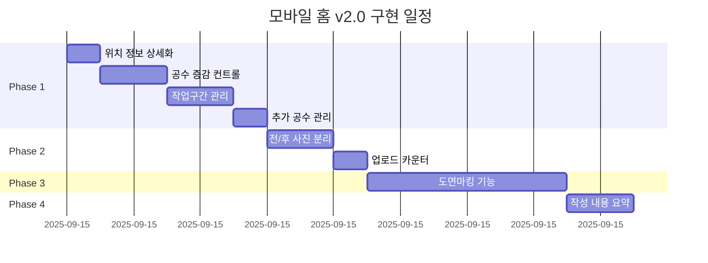

# 모바일 홈 화면 v2.0 구현 계획서

## 📅 작성일: 2025-09-15
## 📋 작성자: Claude Code Assistant
## 🎯 목적: 새로운 디자인 요구사항(v2.0)과 현재 구현의 차이 분석 및 단계적 구현 계획

---

## 1. 개요

### 1.1 현재 상태
- **위치**: `/modules/mobile/components/home/HomePage.tsx`
- **구조**: React 컴포넌트 기반의 간소화된 작업 입력 폼
- **주요 기능**: 빠른메뉴, 공지사항, 현장선택, 작업카드, 일괄업로드

### 1.2 목표 상태 (v2.0)
- **참조**: `/dy_memo/new_image_html_v2.0/html로 미리보기 화면/main.html`
- **구조**: 확장된 작업 입력 폼 with 세부 섹션
- **주요 개선**: 상세 위치 정보, 공수 관리, 전/후 사진 분리, 도면마킹, 요약 뷰

---

## 2. 상세 비교 분석

### 2.1 현재 구현 (HomePage.tsx)

| 섹션 | 구현 상태 | 기능 |
|------|----------|------|
| 빠른메뉴 | ✅ 구현됨 | 9개 메뉴 아이콘 그리드 |
| 공지사항 | ✅ 구현됨 | 3초 자동 슬라이드, 백엔드 연동 |
| 현장선택 | ⚠️ 부분구현 | 기본 선택만 가능 |
| 작업내용 | ⚠️ 부분구현 | 단순 텍스트 입력 |
| 공수입력 | ❌ 미구현 | 숫자 입력만 가능 |
| 사진업로드 | ⚠️ 부분구현 | 일괄 업로드만 지원 |
| 도면마킹 | ❌ 미구현 | - |
| 작성요약 | ❌ 미구현 | - |

### 2.2 새 디자인 요구사항 (v2.0)

| 섹션 | 요구사항 | 상세 기능 |
|------|----------|-----------|
| 소속/현장 선택 | 확장 필요 | 블럭/동/호수 세부 위치 정보 |
| 작성 정보 입력 | 신규 추가 | 일자, 현장, 상세 위치 |
| 작업 내용 기록 | 확장 필요 | 구조화된 작업 내용 입력 |
| 작업구간 | 신규 추가 | 동적 추가/삭제 가능한 작업 구간 |
| 공수(일) | 개선 필요 | +/- 버튼으로 증감 컨트롤 |
| 추가 공수 | 신규 추가 | 작업자별 공수 관리 |
| 사진 업로드 | 개선 필요 | 전/후 분리, 개수 표시, 제한 관리 |
| 도면마킹 | 신규 추가 | 도면 위 작업 위치 표시 |
| 작성 내용 요약 | 신규 추가 | 실시간 프리뷰 |

---

## 3. 구현 계획

### 📌 Phase 1: 핵심 기능 확장 (우선순위: 🔴 높음)
**예상 소요시간: 2-3시간**

#### 3.1.1 위치 정보 상세화
```typescript
// 새로운 필드 추가
interface LocationInfo {
  siteId: string;
  block?: string;    // 블럭
  building?: string; // 동
  unit?: string;     // 호수
}
```

**구현 내용:**
- HomePage.tsx에 블럭/동/호수 입력 필드 추가
- 가운데 정렬된 입력 필드 스타일 적용
- 상태 관리를 위한 useState 추가

#### 3.1.2 공수 증감 컨트롤
```typescript
// NumberInput.tsx 컴포넌트 생성
interface NumberInputProps {
  value: number;
  onChange: (value: number) => void;
  min?: number;
  max?: number;
  step?: number;
}
```

**구현 내용:**
- 재사용 가능한 NumberInput 컴포넌트 생성
- +/- 버튼으로 값 증감
- 키보드 입력 지원
- 최소/최대값 검증

#### 3.1.3 작업구간 동적 관리
```typescript
// WorkSection.tsx 컴포넌트 생성
interface WorkSection {
  id: string;
  name: string;
  description: string;
  manpower: number;
}
```

**구현 내용:**
- 작업구간 추가/삭제 기능
- 각 구간별 공수 입력
- 전체 공수 자동 합산

#### 3.1.4 추가 공수 관리
```typescript
// AdditionalManpower.tsx 컴포넌트 생성
interface AdditionalManpower {
  workerId: string;
  workerName: string;
  hours: number;
}
```

**구현 내용:**
- 작업자 선택 드롭다운
- 작업자별 공수 입력
- 삭제 버튼 (휴지통 아이콘)

---

### 📌 Phase 2: 사진 업로드 개선 (우선순위: 🟡 중간)
**예상 소요시간: 1-2시간**

#### 3.2.1 전/후 사진 분리
```typescript
// PhotoUpload 컴포넌트 분리
interface PhotoUploadProps {
  type: 'before' | 'after';
  files: File[];
  maxFiles: number;
  onUpload: (files: File[]) => void;
  onRemove: (index: number) => void;
}
```

**구현 내용:**
- BeforePhotoUpload.tsx 컴포넌트
- AfterPhotoUpload.tsx 컴포넌트
- 업로드 카운터 표시 (예: 3/10)
- 드래그 앤 드롭 지원

#### 3.2.2 스타일 개선
```css
.photo-upload-grid {
  display: grid;
  grid-template-columns: 1fr 1fr;
  gap: 12px;
}

.upload-area {
  border: 2px dashed #E6ECF4;
  border-radius: 14px;
  padding: 20px;
  min-height: 120px;
}

.upload-counter {
  display: flex;
  align-items: center;
  gap: 4px;
  color: #6B7280;
  font-size: 12px;
}
```

---

### 📌 Phase 3: 도면마킹 기능 (우선순위: 🟢 낮음)
**예상 소요시간: 2-3시간**

#### 3.3.1 DrawingMarkup 컴포넌트
```typescript
// DrawingMarkup.tsx
interface DrawingMarkupProps {
  imageUrl?: string;
  marks: MarkPosition[];
  onAddMark: (position: MarkPosition) => void;
  onRemoveMark: (markId: string) => void;
}

interface MarkPosition {
  id: string;
  x: number;
  y: number;
  label?: string;
}
```

**구현 내용:**
- Canvas 기반 마킹 도구
- 도면 이미지 업로드
- 클릭으로 마킹 추가
- 마킹 라벨 입력

---

### 📌 Phase 4: 작성 내용 요약 (우선순위: 🟡 중간)
**예상 소요시간: 1시간**

#### 3.4.1 WorkSummary 컴포넌트
```typescript
// WorkSummary.tsx
interface WorkSummaryProps {
  data: {
    date: string;
    site: LocationInfo;
    workSections: WorkSection[];
    totalManpower: number;
    photos: {
      before: number;
      after: number;
    };
    drawings: number;
  };
}
```

**구현 내용:**
- 실시간 데이터 바인딩
- 그리드 레이아웃으로 정보 표시
- 섹션별 구분선
- 제출 전 최종 확인

---

## 4. 스타일 시스템 업데이트

### 4.1 CSS 변수 추가
```css
:root {
  /* 새로운 색상 토큰 */
  --tag1: #33E6F6;
  --tag1-20: rgba(51, 230, 246, 0.20);
  --tag3: #2934D0;
  --tag3-70: rgba(41, 52, 208, 0.70);
  --tag3-15: rgba(41, 52, 208, 0.15);
  --tag4: #FFD6EB;
  --tag4-ink: #FF3399;
  
  /* 컨트롤 높이 */
  --chip-h: 48px;
  --btn-h: 44px;
}
```

### 4.2 타이포그래피 시스템
```css
/* Noto Sans KR 웨이트 체계 */
.light { font-weight: 300; }
.regular { font-weight: 400; }
.medium { font-weight: 500; }
.semibold { font-weight: 600; }
.bold { font-weight: 700; }
```

---

## 5. 구현 우선순위 매트릭스

| 우선순위 | Phase | 기능 | 영향도 | 난이도 | 소요시간 |
|---------|-------|------|--------|--------|----------|
| 🔴 높음 | 1 | 위치 정보 상세화 | 높음 | 낮음 | 30분 |
| 🔴 높음 | 1 | 공수 증감 컨트롤 | 높음 | 중간 | 1시간 |
| 🔴 높음 | 1 | 작업구간 관리 | 높음 | 중간 | 1시간 |
| 🔴 높음 | 1 | 추가 공수 관리 | 높음 | 중간 | 30분 |
| 🟡 중간 | 2 | 전/후 사진 분리 | 중간 | 낮음 | 1시간 |
| 🟡 중간 | 2 | 업로드 카운터 | 낮음 | 낮음 | 30분 |
| 🟡 중간 | 4 | 작성 내용 요약 | 중간 | 낮음 | 1시간 |
| 🟢 낮음 | 3 | 도면마킹 | 낮음 | 높음 | 3시간 |

---

## 6. 파일 구조 변경 계획

```
/modules/mobile/
├── components/
│   ├── home/
│   │   ├── HomePage.tsx (수정)
│   │   ├── QuickMenu.tsx (유지)
│   │   ├── NoticeSection.tsx (유지)
│   │   ├── WorkCard.tsx (수정)
│   │   ├── NumberInput.tsx (신규)
│   │   ├── WorkSection.tsx (신규)
│   │   ├── AdditionalManpower.tsx (신규)
│   │   ├── PhotoUpload/
│   │   │   ├── BeforePhotoUpload.tsx (신규)
│   │   │   ├── AfterPhotoUpload.tsx (신규)
│   │   │   └── UploadCounter.tsx (신규)
│   │   ├── DrawingMarkup.tsx (신규)
│   │   └── WorkSummary.tsx (신규)
│   └── styles/
│       ├── home.css (수정)
│       ├── photo-upload.css (신규)
│       ├── drawing-markup.css (신규)
│       └── work-summary.css (신규)
```

---

## 7. 테스트 계획

### 7.1 단위 테스트
- [ ] NumberInput 컴포넌트 증감 로직
- [ ] WorkSection 추가/삭제 기능
- [ ] 사진 업로드 제한 검증
- [ ] 공수 합산 계산

### 7.2 통합 테스트
- [ ] 전체 폼 데이터 수집 및 검증
- [ ] 백엔드 API 연동
- [ ] 요약 뷰 데이터 동기화

### 7.3 사용자 테스트
- [ ] 모바일 디바이스 반응형 테스트
- [ ] 터치 인터랙션 테스트
- [ ] 노년층 사용자 가독성 테스트

---

## 8. 리스크 및 대응 방안

| 리스크 | 영향도 | 대응 방안 |
|--------|--------|-----------|
| 기존 데이터 구조와 호환성 | 높음 | 점진적 마이그레이션, 하위 호환성 유지 |
| 모바일 성능 저하 | 중간 | 컴포넌트 lazy loading, 이미지 최적화 |
| 복잡한 UI로 인한 사용성 저하 | 중간 | 단계별 입력 가이드, 툴팁 추가 |
| Canvas API 브라우저 호환성 | 낮음 | 폴리필 적용, 대체 UI 제공 |

---

## 9. 예상 일정



---

## 10. 완료 기준

### Phase 1 완료 기준
- ✅ 블럭/동/호수 필드가 추가되고 정상 작동
- ✅ 공수 +/- 버튼으로 값 조정 가능
- ✅ 작업구간 3개 이상 추가/삭제 가능
- ✅ 추가 공수 작업자 선택 및 삭제 가능

### Phase 2 완료 기준
- ✅ 전/후 사진 별도 업로드 영역 구분
- ✅ 업로드 개수 실시간 표시
- ✅ 최대 파일 개수 제한 작동

### Phase 3 완료 기준
- ✅ 도면 이미지 업로드 가능
- ✅ 클릭으로 마킹 추가 가능
- ✅ 마킹 위치 저장 및 복원

### Phase 4 완료 기준
- ✅ 입력 데이터 실시간 요약 표시
- ✅ 모든 섹션 데이터 정확히 반영
- ✅ 제출 전 검증 로직 작동

---

## 11. 참고 자료

- 원본 디자인: `/dy_memo/new_image_html_v2.0/html로 미리보기 화면/main.html`
- 데이터 로직: `/dy_memo/new_image_html_v2.0/html로 미리보기 화면/[HOME]데이터 로직 요약.txt`
- 현재 구현: `/modules/mobile/components/home/HomePage.tsx`
- 스타일시트: `/modules/mobile/styles/home.css`

---

## 12. 결론

새로운 디자인 요구사항(v2.0)은 현재 구현 대비 **약 60% 이상의 기능 확장**이 필요합니다. 
단계별 구현을 통해 리스크를 최소화하면서 사용자 경험을 점진적으로 개선할 수 있습니다.

**권장 구현 순서:**
1. Phase 1 (핵심 기능) - 즉시 시작
2. Phase 2 (사진 개선) - Phase 1 완료 후
3. Phase 4 (요약 뷰) - Phase 2와 병행 가능
4. Phase 3 (도면마킹) - 여유 시간에 구현

**총 예상 소요시간: 7-9시간**

---

*이 문서는 2025년 9월 15일 작성되었으며, 프로젝트 진행 상황에 따라 업데이트될 수 있습니다.*