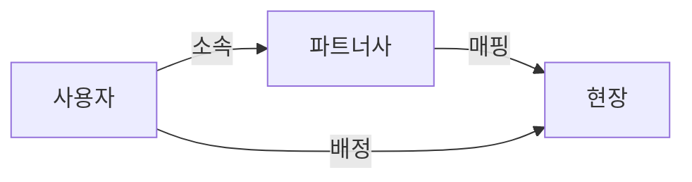

# 사용자 배정 시스템 사용 가이드

## 📚 목차

1. [시스템 개요](#시스템-개요)
2. [핵심 개념 이해](#핵심-개념-이해)
3. [시작하기](#시작하기)
4. [주요 기능 사용법](#주요-기능-사용법)
5. [드래그 앤 드롭 배정](#드래그-앤-드롭-배정)
6. [자주 묻는 질문](#자주-묻는-질문)
7. [문제 해결](#문제-해결)

---

## 🎯 시스템 개요

사용자 배정 시스템은 파트너사 소속 작업자들을 효율적으로 현장에 배정하고 관리하는 통합 시스템입니다.

### 주요 특징
- ✅ **직관적인 인터페이스**: 드래그 앤 드롭으로 간편한 배정
- ✅ **통합 대시보드**: 전체 배정 현황을 한눈에 파악
- ✅ **2단계 배정 시스템**: 파트너사-현장 매핑 → 사용자 배정
- ✅ **실시간 동기화**: 모든 변경사항이 즉시 반영

---

## 💡 핵심 개념 이해

### 1. 파트너사 소속 vs 현장 배정

```
📌 파트너사 소속
- 사용자가 계약상 소속된 회사
- 급여, 보험 등 행정 처리 기준
- 자주 변경 가능

📍 현장 배정  
- 실제 작업을 수행하는 현장
- 관리자가 명시적으로 지정
- 접근 권한과 업무 할당 기준
```

### 2. 배정 프로세스



---

## 🚀 시작하기

### Step 1: 통합 대시보드 접속

1. 관리자 계정으로 로그인
2. 좌측 메뉴에서 **"통합 배정 관리"** 클릭
3. 대시보드 화면 확인

![대시보드 화면]
```
┌─────────────────────────────────────┐
│  📊 통합 배정 관리 대시보드         │
├─────────────────────────────────────┤
│  ┌──────┐ ┌──────┐ ┌──────┐ ┌──────┐│
│  │ 전체 │ │ 배정 │ │미배정│ │ 현장 ││
│  │ 45명 │ │ 38명 │ │ 7명  │ │ 12개 ││
│  └──────┘ └──────┘ └──────┘ └──────┘│
└─────────────────────────────────────┘
```

### Step 2: 현재 상태 파악

대시보드에서 확인할 수 있는 정보:
- **전체 사용자 수**: 시스템에 등록된 모든 사용자
- **배정된 사용자**: 현장에 배정된 사용자
- **미배정 사용자**: 아직 현장이 없는 사용자
- **활성 현장**: 운영 중인 현장 수
- **파트너사 매핑**: 파트너사-현장 연결 수

---

## 📋 주요 기능 사용법

### 1. 파트너사-현장 매핑

#### 새 매핑 추가하기

1. **"파트너사-현장 매핑"** 탭 클릭
2. **"+ 새 매핑"** 버튼 클릭
3. 정보 입력:
   ```
   파트너사: [드롭다운에서 선택]
   현장: [드롭다운에서 선택]
   시작일: [날짜 선택]
   종료일: [선택사항]
   메모: [선택사항]
   ```
4. **"매핑 추가"** 클릭

#### 매핑 관리하기

- **수정**: 매핑 카드의 연필 아이콘 클릭
- **삭제**: 매핑 카드의 휴지통 아이콘 클릭
- **상태 변경**: 활성/비활성 토글 스위치 사용

### 2. 개별 사용자 배정

#### 방법 1: 사용자 배정 탭 사용

1. **"사용자 배정"** 탭 클릭
2. **"개별 배정"** 버튼 클릭
3. 배정 정보 입력:
   ```
   사용자: [미배정 사용자 목록에서 선택]
   현장: [활성 현장 목록에서 선택]
   배정 유형: 정규 / 임시 / 대체
   현장 역할: 작업자 / 감독자 / 현장관리자
   메모: [선택사항]
   ```
4. **"배정하기"** 클릭

#### 방법 2: 미배정 사용자 카드에서 직접 배정

1. **"미배정 사용자"** 탭에서 사용자 찾기
2. 사용자 카드의 **"배정하기"** 버튼 클릭
3. 현장 및 상세 정보 입력
4. 확인

### 3. 일괄 배정

여러 사용자를 한번에 배정할 때 사용합니다.

1. **"사용자 배정"** 탭 → **"일괄 배정"** 버튼
2. 배정 조건 설정:
   ```
   대상 현장: [선택]
   파트너사 필터: [특정 파트너사 또는 전체]
   배정 유형: [선택]
   현장 역할: [선택]
   ```
3. 사용자 목록에서 체크박스로 선택
4. **"N명 배정하기"** 클릭

### 4. 배정 해제

1. 배정된 사용자 카드 찾기
2. **"배정 해제"** 버튼 클릭
3. 확인 대화상자에서 **"예"** 선택

---

## 🎯 드래그 앤 드롭 배정

### 새로운 드래그 앤 드롭 인터페이스

가장 직관적이고 빠른 배정 방법입니다.

#### 화면 구성

```
┌──────────────┬─────────────────────────┐
│ 미배정 사용자 │      현장 목록           │
├──────────────┼──────────┬──────────────┤
│              │  현장 A   │   현장 B     │
│  👤 김작업   ├──────────┼──────────────┤
│  👤 이작업   │ 👤 박작업 │ 👤 최작업    │
│  👤 박작업   │ 👤 정작업 │ 👤 강작업    │
│              │          │              │
└──────────────┴──────────┴──────────────┘
```

#### 사용 방법

##### 1. 새 사용자 배정하기
1. 왼쪽 **"미배정 사용자"** 목록에서 사용자 카드 선택
2. 마우스로 **드래그** 시작
3. 원하는 현장 박스 위로 이동
4. 현장 박스가 파란색으로 변하면 **드롭**
5. 자동으로 배정 완료!

##### 2. 사용자를 다른 현장으로 이동
1. 현재 배정된 사용자 카드를 **드래그**
2. 다른 현장 박스로 이동
3. **드롭**하여 현장 변경
4. 이전 현장에서 자동 해제 + 새 현장에 배정

##### 3. 시각적 피드백
- 🔵 **파란색 테두리**: 드롭 가능한 영역
- ✋ **드래그 중**: 카드에 그림자 효과
- ✅ **배정 완료**: 녹색 알림 메시지

#### 드래그 앤 드롭 장점
- ⚡ **빠른 작업**: 클릭 몇 번 없이 즉시 배정
- 👁️ **시각적 확인**: 전체 배정 상황을 보면서 작업
- 🔄 **즉시 동기화**: 변경사항이 실시간 반영
- 📱 **직관적**: 별도 학습 없이 사용 가능

---

## 📊 배정 현황 모니터링

### 통계 대시보드 활용

1. **전체 현황** 탭에서 주요 지표 확인
2. 색상별 상태 구분:
   - 🟢 녹색: 정상 배정
   - 🟡 노란색: 주의 필요
   - 🔴 빨간색: 즉시 조치 필요

### 필터 활용하기

```
검색: [사용자명, 이메일, 현장명]
역할: [전체 / 작업자 / 현장관리자 / 파트너사]
상태: [활성 / 비활성 / 전체]
```

---

## ❓ 자주 묻는 질문

### Q1. 파트너사 소속과 현장 배정의 차이는?

**A:** 파트너사 소속은 계약상 소속 회사이고, 현장 배정은 실제 작업 장소입니다.
- 파트너사 소속: 급여, 보험 처리 기준
- 현장 배정: 출퇴근, 작업 지시 기준

### Q2. 한 사용자를 여러 현장에 배정할 수 있나요?

**A:** 아니요. 한 사용자는 한 번에 하나의 현장에만 배정 가능합니다.
다른 현장으로 이동 시 기존 배정을 해제하고 새로 배정해야 합니다.

### Q3. 임시 배정과 정규 배정의 차이는?

**A:** 
- **정규 배정**: 장기간 고정 배치
- **임시 배정**: 단기간 한시적 배치
- **대체 배정**: 다른 작업자 대신 임시 배치

### Q4. 배정 이력은 어디서 확인하나요?

**A:** **"배정 이력"** 버튼을 클릭하면 과거 모든 배정 기록을 확인할 수 있습니다.

### Q5. 드래그 앤 드롭이 작동하지 않아요.

**A:** 다음을 확인하세요:
1. 최신 브라우저 사용 (Chrome, Edge, Firefox 권장)
2. 화면 확대/축소 비율 100% 설정
3. 페이지 새로고침 (F5)

---

## 🔧 문제 해결

### 문제 1: 배정이 저장되지 않음

**해결 방법:**
1. 네트워크 연결 확인
2. 필수 입력 항목 모두 입력했는지 확인
3. 페이지 새로고침 후 재시도
4. 문제 지속 시 관리자 문의

### 문제 2: 사용자가 목록에 나타나지 않음

**해결 방법:**
1. 검색 필터 초기화
2. 역할 필터를 "전체"로 변경
3. 사용자 관리에서 계정 상태 확인
4. 비활성 사용자인지 확인

### 문제 3: 드래그 앤 드롭 시 오류 발생

**해결 방법:**
1. 동시에 여러 작업 진행 중인지 확인
2. 이전 작업 완료 대기
3. 페이지 새로고침
4. 다른 브라우저에서 시도

### 문제 4: 파트너사 매핑이 보이지 않음

**해결 방법:**
1. 파트너사가 시스템에 등록되어 있는지 확인
2. 현장이 활성 상태인지 확인
3. 매핑 권한이 있는지 확인

---

## 💡 유용한 팁

### 효율적인 배정 관리

1. **정기적인 점검**: 매주 월요일 미배정 사용자 확인
2. **일괄 작업 활용**: 같은 파트너사 사용자는 일괄 배정
3. **메모 활용**: 특이사항은 반드시 메모에 기록
4. **이력 확인**: 배정 변경 전 이전 이력 확인

### 추천 워크플로우

```
1. 월요일: 주간 배정 계획 수립
2. 화요일: 신규 사용자 배정
3. 수요일-목요일: 배정 조정
4. 금요일: 다음 주 준비 및 점검
```

---

## 📞 추가 지원

### 도움이 필요하신가요?

- **시스템 관리자**: admin@company.com
- **기술 지원**: support@company.com
- **긴급 문의**: 02-1234-5678

### 교육 자료

- [동영상 튜토리얼](링크)
- [자세한 매뉴얼 다운로드](링크)
- [FAQ 전체 목록](링크)

---

## 🎉 축하합니다!

이제 사용자 배정 시스템의 모든 기능을 활용할 준비가 되었습니다.
효율적인 인력 관리로 프로젝트 성공에 기여하세요!

---

**문서 버전**: v2.0  
**최종 수정일**: 2025년 9월 11일  
**다음 업데이트**: 자동 배정 기능 추가 예정